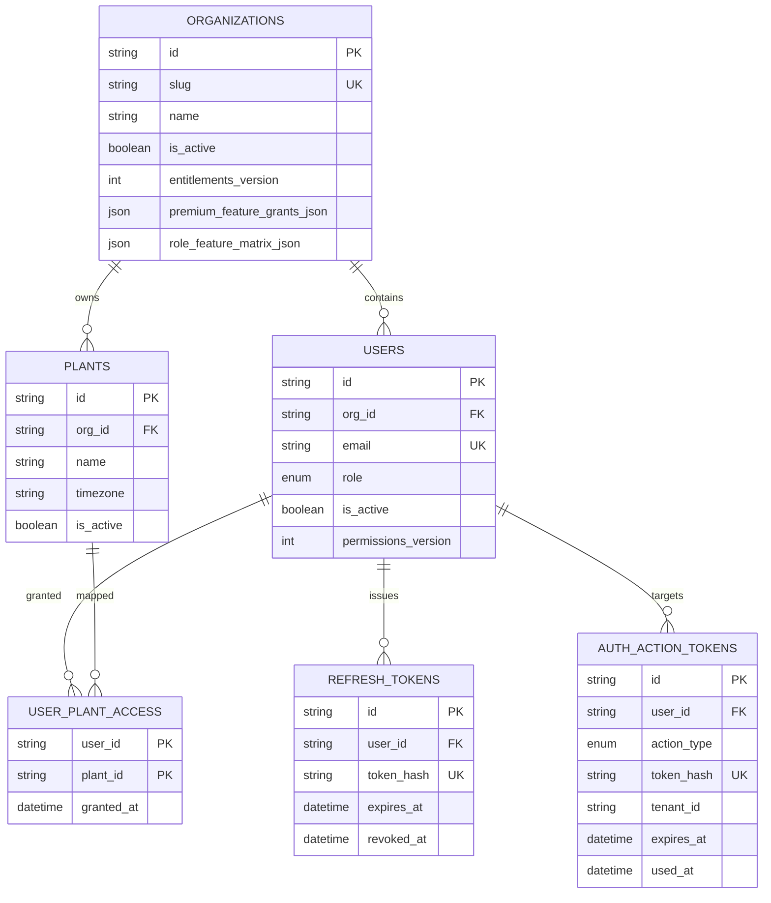
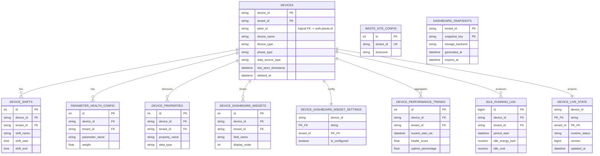
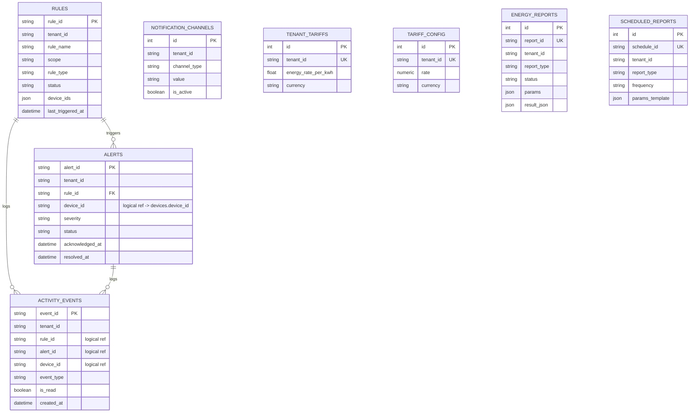
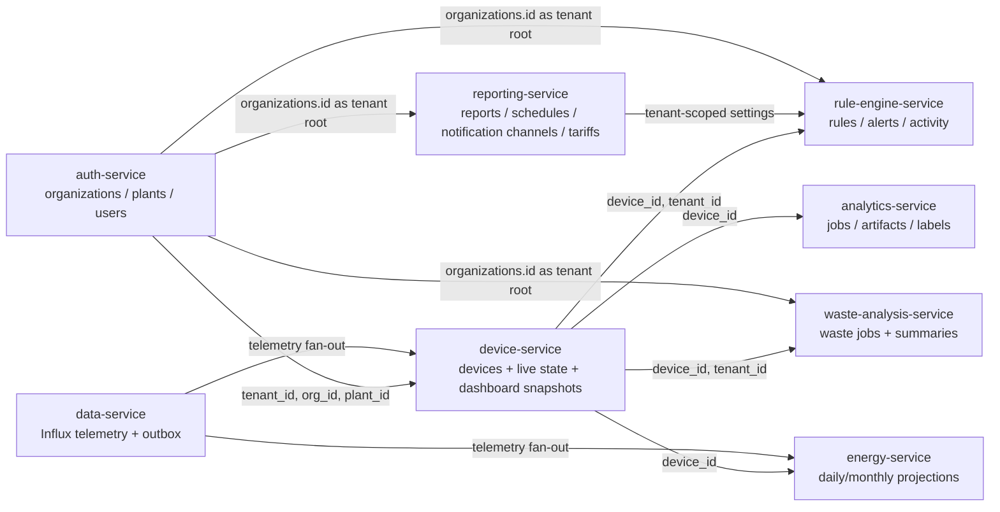

# Database Schema Reference

## Purpose
This document describes the **current database schema** for the FactoryOPS multi-service platform as implemented in the repository source code.

It is derived from the **actual source of truth**:
- SQLAlchemy ORM models
- Alembic migrations
- repository/query code that reads and writes the tables

Where model definitions and older migrations differ, this document follows the **latest effective schema implied by the newest migrations plus the current application code**. Historical migration drift is called out explicitly where it matters for changes or operational safety.

This document covers the database-owning services in the repo:
- `auth-service`
- `device-service`
- `data-service`
- `reporting-service`
- `rule-engine-service`
- `waste-analysis-service`
- `analytics-service`
- `energy-service`
- `data-export-service`

It also calls out:
- tenant isolation patterns
- logical versus DB-enforced relationships
- indexes and uniqueness rules
- high-risk data type changes and the files that must move together

---

## ER Diagrams
These diagrams are simplified from the full schema sections below. They are meant to help managers and senior engineers understand:
- which service owns which tables
- where tenant scope lives
- which relationships are DB-enforced versus logical
- how cross-service data flows hang together

Legend:
- solid relationship lines represent DB-enforced foreign keys
- notes in labels call out logical or cross-service references that are enforced in application code instead of by the database

### 1. Tenant and Identity Core

### 2. Device, Live State, and Dashboard Domain

### 3. Rule, Alert, Notification, and Reporting Domain

### 4. Telemetry, Waste, Analytics, Energy, and Export Domain

```mermaid
erDiagram
    TELEMETRY_OUTBOX {
        bigint id PK
        string device_id
        json telemetry_json
        string target
        string status
        int retry_count
    }

    RECONCILIATION_LOG {
        bigint id PK
        string device_id
        datetime checked_at
        int drift_seconds
        string action_taken
    }

    DLQ_MESSAGES {
        bigint id PK
        datetime timestamp
        string error_type
        string status
        json original_payload
    }

    WASTE_ANALYSIS_JOBS {
        string id PK
        string tenant_id
        string scope
        date start_date
        date end_date
        string granularity
        string status
    }

    WASTE_DEVICE_SUMMARY {
        int id PK
        string job_id
        string device_id
        float total_energy_kwh
        float total_cost
    }

    ANALYTICS_JOBS {
        string id PK
        string job_id UK
        string device_id
        string analysis_type
        string status
        json parameters "includes tenant_id logically"
    }

    ML_MODEL_ARTIFACTS {
        string id PK
        string device_id
        string analysis_type
        string model_key
        blob artifact_payload
    }

    ANALYTICS_WORKER_HEARTBEATS {
        string worker_id PK
        datetime last_heartbeat_at
        string status
    }

    FAILURE_EVENT_LABELS {
        string id PK
        string device_id
        datetime event_time
        string event_type
    }

    ANALYTICS_ACCURACY_EVALUATIONS {
        string id PK
        string analysis_type
        string scope_device_id
        float f1_score
        int is_certified
    }

    ENERGY_DEVICE_STATE {
        string device_id PK
        string session_state
        bigint version
    }

    ENERGY_DEVICE_DAY {
        int id PK
        string device_id
        date day
        float energy_kwh
        float loss_kwh
    }

    ENERGY_DEVICE_MONTH {
        int id PK
        string device_id
        date month
        float energy_kwh
        float loss_kwh
    }

    ENERGY_FLEET_DAY {
        date day PK
        float energy_kwh
        bigint version
    }

    ENERGY_FLEET_MONTH {
        date month PK
        float energy_kwh
        bigint version
    }

    ENERGY_RECONCILE_AUDIT {
        int id PK
        string device_id
        date day
        float drift_kwh
        boolean repaired
    }

    EXPORT_CHECKPOINTS {
        int id PK
        string device_id
        datetime last_exported_at
        string status
        string s3_key
    }

    WASTE_ANALYSIS_JOBS ||--o{ WASTE_DEVICE_SUMMARY : "contains"
```

### 5. Cross-Service Ownership Flow

---

## How To Read This Document
- “Owning service” means the service that defines and migrates the table.
- “Logical foreign key” means application code depends on another table/service, but the database does not enforce the relationship.
- “Tenant-owned” means the row is expected to be accessed only inside a tenant/org scope.
- “Global/system” means the table is not partitioned by tenant and is shared platform state.

---

## Service-By-Service Schema

## Auth Service
**Database purpose**

Identity, organizations, plants, user membership, refresh tokens, and auth action flows.

**Owned tables**
- `organizations`
- `plants`
- `users`
- `user_plant_access`
- `refresh_tokens`
- `auth_action_tokens`

**Primary schema sources**
- `/Users/vedanthshetty/Desktop/GIT-Testing/FactoryOPS-Cittagent-Obeya-main/services/auth-service/app/models/auth.py`
- `/Users/vedanthshetty/Desktop/GIT-Testing/FactoryOPS-Cittagent-Obeya-main/services/auth-service/alembic/versions/0001_initial_auth_schema.py`
- `/Users/vedanthshetty/Desktop/GIT-Testing/FactoryOPS-Cittagent-Obeya-main/services/auth-service/alembic/versions/0002_add_user_permissions_version.py`
- `/Users/vedanthshetty/Desktop/GIT-Testing/FactoryOPS-Cittagent-Obeya-main/services/auth-service/alembic/versions/0003_add_auth_action_tokens.py`
- `/Users/vedanthshetty/Desktop/GIT-Testing/FactoryOPS-Cittagent-Obeya-main/services/auth-service/alembic/versions/0004_add_org_feature_entitlements.py`
- `/Users/vedanthshetty/Desktop/GIT-Testing/FactoryOPS-Cittagent-Obeya-main/services/auth-service/alembic/versions/0005_fix_org_feature_entitlement_json_values.py`
- `/Users/vedanthshetty/Desktop/GIT-Testing/FactoryOPS-Cittagent-Obeya-main/services/auth-service/alembic/versions/0006_add_refresh_token_cleanup_indexes.py`

### Table: `organizations`
Purpose: top-level tenant/org record plus feature entitlements.

Owning service: `auth-service`

| Column | Database type | Nullable | Default | Key / constraint | Description |
|---|---|---:|---|---|---|
| `id` | `VARCHAR(36)` | No | UUID generated in app | Primary key | Organization identifier used as tenant/org ID across services. |
| `name` | `VARCHAR(255)` | No | None | None | Human-readable organization name. |
| `slug` | `VARCHAR(100)` | No | None | Unique, indexed | Stable org slug for lookup and management flows. |
| `is_active` | `BOOLEAN` | No | `true` | None | Soft activation flag for the org. |
| `entitlements_version` | `INTEGER` | No | `0` | None | Version counter for feature entitlement changes. |
| `premium_feature_grants_json` | `JSON` | No | empty list | None | Organization-level enabled premium features. |
| `role_feature_matrix_json` | `JSON` | No | default role matrix | None | Per-role feature grants inside the org. |
| `created_at` | `TIMESTAMP WITH TIME ZONE` | No | `CURRENT_TIMESTAMP` / `now()` | None | Creation timestamp. |
| `updated_at` | `TIMESTAMP WITH TIME ZONE` | No | `CURRENT_TIMESTAMP` / `now()` | None | Last update timestamp. |

Primary key: `id`

Foreign keys: none

Unique constraints:
- `slug`

Indexes:
- `ix_organizations_slug (slug)`

Tenant ownership / isolation notes:
- This is the root tenant table. Many other services copy or reference `organizations.id` as `tenant_id`.

Important read/write paths:
- `/Users/vedanthshetty/Desktop/GIT-Testing/FactoryOPS-Cittagent-Obeya-main/services/auth-service/app/repositories/org_repository.py`
- `/Users/vedanthshetty/Desktop/GIT-Testing/FactoryOPS-Cittagent-Obeya-main/services/auth-service/app/api/v1/orgs.py`

### Table: `plants`
Purpose: sub-tenant plant/site records inside an organization.

Owning service: `auth-service`

| Column | Database type | Nullable | Default | Key / constraint | Description |
|---|---|---:|---|---|---|
| `id` | `VARCHAR(36)` | No | UUID generated in app | Primary key | Plant identifier. |
| `org_id` | `VARCHAR(36)` | No | None | FK to `organizations.id` | Parent organization. |
| `name` | `VARCHAR(255)` | No | None | None | Plant/site name. |
| `location` | `VARCHAR(500)` | Yes | None | None | Optional free-text location. |
| `timezone` | `VARCHAR(64)` | No | `Asia/Kolkata` | None | Default plant time zone. |
| `is_active` | `BOOLEAN` | No | `true` | None | Soft activation flag. |
| `created_at` | `TIMESTAMP WITH TIME ZONE` | No | `CURRENT_TIMESTAMP` | None | Creation timestamp. |
| `updated_at` | `TIMESTAMP WITH TIME ZONE` | No | `CURRENT_TIMESTAMP` | None | Last update timestamp. |

Primary key: `id`

Foreign keys:
- `org_id -> organizations.id` (`ON DELETE CASCADE`)

Unique constraints: none

Indexes:
- `ix_plants_org_id (org_id)`

Tenant ownership / isolation notes:
- Plant rows are tenant-owned through `org_id`.
- Other services may hold `plant_id` as a logical foreign key, especially device-service.

Important read/write paths:
- `/Users/vedanthshetty/Desktop/GIT-Testing/FactoryOPS-Cittagent-Obeya-main/services/auth-service/app/repositories/plant_repository.py`
- `/Users/vedanthshetty/Desktop/GIT-Testing/FactoryOPS-Cittagent-Obeya-main/services/auth-service/app/api/v1/orgs.py`

### Table: `users`
Purpose: local user accounts and role assignment.

Owning service: `auth-service`

| Column | Database type | Nullable | Default | Key / constraint | Description |
|---|---|---:|---|---|---|
| `id` | `VARCHAR(36)` | No | UUID generated in app | Primary key | User identifier. |
| `org_id` | `VARCHAR(36)` | Yes | None | FK to `organizations.id` | Tenant/org membership for non-super-admin users. |
| `email` | `VARCHAR(255)` | No | None | Unique, indexed | Login identity. |
| `hashed_password` | `VARCHAR(255)` | No | None | None | Password hash. |
| `full_name` | `VARCHAR(255)` | Yes | None | None | Display name. |
| `role` | SQL enum `userrole` | No | None | None | One of `super_admin`, `org_admin`, `plant_manager`, `operator`, `viewer`. |
| `permissions_version` | `INTEGER` | No | `0` | None | Used to invalidate cached permissions. |
| `is_active` | `BOOLEAN` | No | `true` | None | Soft activation flag. |
| `created_at` | `TIMESTAMP WITH TIME ZONE` | No | `CURRENT_TIMESTAMP` | None | Creation timestamp. |
| `updated_at` | `TIMESTAMP WITH TIME ZONE` | No | `CURRENT_TIMESTAMP` | None | Last update timestamp. |
| `last_login_at` | `TIMESTAMP WITH TIME ZONE` | Yes | None | None | Most recent successful login. |

Primary key: `id`

Foreign keys:
- `org_id -> organizations.id` (`ON DELETE SET NULL`)

Unique constraints:
- `email`

Indexes:
- `ix_users_org_id (org_id)`
- `ix_users_email (email)`

Tenant ownership / isolation notes:
- `super_admin` users can have `org_id = NULL`.
- All org-scoped users are tenant-owned via `org_id`.

Important read/write paths:
- `/Users/vedanthshetty/Desktop/GIT-Testing/FactoryOPS-Cittagent-Obeya-main/services/auth-service/app/repositories/user_repository.py`
- `/Users/vedanthshetty/Desktop/GIT-Testing/FactoryOPS-Cittagent-Obeya-main/services/auth-service/app/api/v1/auth.py`
- `/Users/vedanthshetty/Desktop/GIT-Testing/FactoryOPS-Cittagent-Obeya-main/services/auth-service/app/api/v1/admin.py`
- `/Users/vedanthshetty/Desktop/GIT-Testing/FactoryOPS-Cittagent-Obeya-main/services/auth-service/app/api/v1/orgs.py`

### Table: `user_plant_access`
Purpose: many-to-many mapping from user to plant permissions.

Owning service: `auth-service`

| Column | Database type | Nullable | Default | Key / constraint | Description |
|---|---|---:|---|---|---|
| `user_id` | `VARCHAR(36)` | No | None | PK, FK to `users.id` | User granted access. |
| `plant_id` | `VARCHAR(36)` | No | None | PK, FK to `plants.id` | Plant the user may access. |
| `granted_at` | `TIMESTAMP WITH TIME ZONE` | No | `CURRENT_TIMESTAMP` | None | Grant timestamp. |

Primary key:
- composite primary key `(user_id, plant_id)`

Foreign keys:
- `user_id -> users.id` (`ON DELETE CASCADE`)
- `plant_id -> plants.id` (`ON DELETE CASCADE`)

Unique constraints:
- enforced by composite primary key

Indexes:
- no additional secondary indexes beyond PK

Tenant ownership / isolation notes:
- Tenant ownership is indirect through `users.org_id` and `plants.org_id`.
- Caller/target tenant matching is also enforced in API/service logic.

Important read/write paths:
- `/Users/vedanthshetty/Desktop/GIT-Testing/FactoryOPS-Cittagent-Obeya-main/services/auth-service/app/repositories/user_repository.py`
- `/Users/vedanthshetty/Desktop/GIT-Testing/FactoryOPS-Cittagent-Obeya-main/services/auth-service/app/api/v1/orgs.py`

### Table: `refresh_tokens`
Purpose: persistent refresh token store for session renewal and revocation.

Owning service: `auth-service`

| Column | Database type | Nullable | Default | Key / constraint | Description |
|---|---|---:|---|---|---|
| `id` | `VARCHAR(36)` | No | UUID generated in app | Primary key | Refresh token row ID. |
| `user_id` | `VARCHAR(36)` | No | None | FK to `users.id`, indexed | Owning user. |
| `token_hash` | `VARCHAR(255)` | No | None | Unique, indexed | Hashed refresh token. |
| `expires_at` | `TIMESTAMP WITH TIME ZONE` | No | None | Indexed | Token expiry. |
| `revoked_at` | `TIMESTAMP WITH TIME ZONE` | Yes | None | Indexed | Revocation timestamp. |
| `created_at` | `TIMESTAMP WITH TIME ZONE` | No | `CURRENT_TIMESTAMP` | None | Creation timestamp. |

Primary key: `id`

Foreign keys:
- `user_id -> users.id` (`ON DELETE CASCADE`)

Unique constraints:
- `token_hash`

Indexes:
- `ix_refresh_tokens_user_id (user_id)`
- `ix_refresh_tokens_token_hash (token_hash)`
- `ix_refresh_tokens_expires_at (expires_at)`
- `ix_refresh_tokens_revoked_at (revoked_at)`

Tenant ownership / isolation notes:
- Indirect tenant ownership through `user_id -> users.org_id`.

Important read/write paths:
- `/Users/vedanthshetty/Desktop/GIT-Testing/FactoryOPS-Cittagent-Obeya-main/services/auth-service/app/repositories/user_repository.py`
- `/Users/vedanthshetty/Desktop/GIT-Testing/FactoryOPS-Cittagent-Obeya-main/services/auth-service/app/services/token_cleanup_service.py`
- `/Users/vedanthshetty/Desktop/GIT-Testing/FactoryOPS-Cittagent-Obeya-main/services/auth-service/app/api/v1/auth.py`

### Table: `auth_action_tokens`
Purpose: password reset and invite set-password token records.

Owning service: `auth-service`

| Column | Database type | Nullable | Default | Key / constraint | Description |
|---|---|---:|---|---|---|
| `id` | `VARCHAR(36)` | No | UUID generated in app | Primary key | Action token row ID. |
| `user_id` | `VARCHAR(36)` | No | None | FK to `users.id`, indexed | Target user. |
| `action_type` | SQL enum `authactiontype` | No | None | None | `invite_set_password` or `password_reset`. |
| `token_hash` | `VARCHAR(64)` | No | None | Unique, indexed | Hashed one-time action token. |
| `expires_at` | `TIMESTAMP WITH TIME ZONE` | No | None | None | Expiry timestamp. |
| `used_at` | `TIMESTAMP WITH TIME ZONE` | Yes | None | None | Consumption timestamp. |
| `created_by_user_id` | `VARCHAR(36)` | Yes | None | None | User who created the token, if tracked. |
| `created_by_role` | `VARCHAR(50)` | Yes | None | None | Creator role snapshot. |
| `tenant_id` | `VARCHAR(36)` | Yes | None | Indexed | Tenant context carried with the action. |
| `metadata_json` | `VARCHAR(2000)` | Yes | None | None | Serialized metadata payload. |
| `created_at` | `TIMESTAMP WITH TIME ZONE` | No | `CURRENT_TIMESTAMP` | None | Creation timestamp. |

Primary key: `id`

Foreign keys:
- `user_id -> users.id` (`ON DELETE CASCADE`)

Unique constraints:
- `token_hash`

Indexes:
- `ix_auth_action_tokens_user_id (user_id)`
- `ix_auth_action_tokens_token_hash (token_hash)`
- `ix_auth_action_tokens_tenant_id (tenant_id)`

Tenant ownership / isolation notes:
- Not every token is org-bound, but org/user invitation flows use tenant-carrying tokens.

Important read/write paths:
- `/Users/vedanthshetty/Desktop/GIT-Testing/FactoryOPS-Cittagent-Obeya-main/services/auth-service/app/api/v1/orgs.py`
- `/Users/vedanthshetty/Desktop/GIT-Testing/FactoryOPS-Cittagent-Obeya-main/services/auth-service/app/api/v1/auth.py`

---

## Device Service
**Database purpose**

Inventory, live state, shift/config metadata, dashboard snapshot caching, waste/idle-related per-device settings, and performance trend projections.

**Owned tables**
- `devices`
- `device_shifts`
- `parameter_health_config`
- `device_performance_trends`
- `device_properties`
- `device_dashboard_widgets`
- `device_dashboard_widget_settings`
- `idle_running_log`
- `device_live_state`
- `waste_site_config`
- `dashboard_snapshots`

**Primary schema sources**
- `/Users/vedanthshetty/Desktop/GIT-Testing/FactoryOPS-Cittagent-Obeya-main/services/device-service/app/models/device.py`
- `/Users/vedanthshetty/Desktop/GIT-Testing/FactoryOPS-Cittagent-Obeya-main/services/device-service/alembic/versions/20260329_0001_composite_device_pk.py`
- `/Users/vedanthshetty/Desktop/GIT-Testing/FactoryOPS-Cittagent-Obeya-main/services/device-service/alembic/versions/20260331_0001_add_tenant_id_to_scoped_tables.py`
- `/Users/vedanthshetty/Desktop/GIT-Testing/FactoryOPS-Cittagent-Obeya-main/services/device-service/alembic/versions/20260331_0002_enforce_tenant_not_null.py`
- `/Users/vedanthshetty/Desktop/GIT-Testing/FactoryOPS-Cittagent-Obeya-main/services/device-service/alembic/versions/20260403_0001_dashboard_snapshots_tenant_scope.py`

### Table: `devices`
Purpose: authoritative device inventory row and per-device operational metadata.

Owning service: `device-service`

| Column | Database type | Nullable | Default | Key / constraint | Description |
|---|---|---:|---|---|---|
| `device_id` | `VARCHAR(50)` | No | None | Composite PK | Business identifier for the device. |
| `tenant_id` | `VARCHAR(50)` | No | None | Composite PK, indexed | Owning tenant/org. |
| `plant_id` | `VARCHAR(36)` | Yes | None | Indexed, logical ref | Plant/site ID from auth-service. |
| `device_name` | `VARCHAR(255)` | No | None | None | Human-readable device name. |
| `device_type` | `VARCHAR(100)` | No | None | Indexed | Equipment category/type. |
| `manufacturer` | `VARCHAR(255)` | Yes | None | None | Optional manufacturer. |
| `model` | `VARCHAR(255)` | Yes | None | None | Optional hardware model. |
| `location` | `VARCHAR(500)` | Yes | None | None | Optional location description. |
| `phase_type` | `VARCHAR(20)` | Yes | None | Indexed | Electrical phase type used by reporting and energy logic. |
| `data_source_type` | `VARCHAR(20)` | No | `metered` | Indexed | Source classification for calculations. |
| `idle_current_threshold` | `NUMERIC(10,4)` | Yes | None | None | Per-device idle threshold in amps. |
| `overconsumption_current_threshold_a` | `NUMERIC(10,4)` | Yes | None | None | Per-device overconsumption threshold in amps. |
| `unoccupied_weekday_start_time` | `TIME` | Yes | None | None | Default weekday off-hours start. |
| `unoccupied_weekday_end_time` | `TIME` | Yes | None | None | Default weekday off-hours end. |
| `unoccupied_weekend_start_time` | `TIME` | Yes | None | None | Default weekend off-hours start. |
| `unoccupied_weekend_end_time` | `TIME` | Yes | None | None | Default weekend off-hours end. |
| `legacy_status` | `VARCHAR(50)` | No | `active` | Indexed | Deprecated status field kept for compatibility. |
| `last_seen_timestamp` | `TIMESTAMP WITH TIME ZONE` | Yes | None | Indexed | Last telemetry receipt timestamp. |
| `metadata_json` | `TEXT` | Yes | None | None | Extensible metadata blob. |
| `created_at` | `TIMESTAMP WITH TIME ZONE` | No | app default | None | Creation timestamp. |
| `updated_at` | `TIMESTAMP WITH TIME ZONE` | No | app default / on update | None | Last update timestamp. |
| `deleted_at` | `TIMESTAMP WITH TIME ZONE` | Yes | None | None | Soft-delete marker. |

Primary key:
- composite primary key `(device_id, tenant_id)`

Foreign keys:
- No DB-enforced FK to `plants`; `plant_id` is a logical ref into auth-service.

Unique constraints:
- enforced by composite primary key

Indexes:
- single-column indexes on `tenant_id`, `plant_id`, `device_type`, `phase_type`, `data_source_type`, `legacy_status`, `last_seen_timestamp`

Tenant ownership / isolation notes:
- Core tenant-owned table for device-service.
- Tenant scope became first-class with the composite PK migration.

Important read/write paths:
- `/Users/vedanthshetty/Desktop/GIT-Testing/FactoryOPS-Cittagent-Obeya-main/services/device-service/app/repositories/device.py`
- `/Users/vedanthshetty/Desktop/GIT-Testing/FactoryOPS-Cittagent-Obeya-main/services/device-service/app/services/device.py`
- `/Users/vedanthshetty/Desktop/GIT-Testing/FactoryOPS-Cittagent-Obeya-main/services/device-service/app/services/live_projection.py`
- `/Users/vedanthshetty/Desktop/GIT-Testing/FactoryOPS-Cittagent-Obeya-main/services/device-service/app/api/v1/devices.py`

### Table: `device_shifts`
Purpose: scheduled production shift windows per device.

Owning service: `device-service`

| Column | Database type | Nullable | Default | Key / constraint | Description |
|---|---|---:|---|---|---|
| `id` | `INTEGER` | No | auto increment | Primary key | Row ID. |
| `device_id` | `VARCHAR(50)` | No | None | Part of composite FK to `devices` | Device business ID. |
| `tenant_id` | `VARCHAR(50)` | No | None | Part of composite FK, indexed | Owning tenant. |
| `shift_name` | `VARCHAR(100)` | No | None | None | Shift label. |
| `shift_start` | `TIME` | No | None | None | Shift start time. |
| `shift_end` | `TIME` | No | None | None | Shift end time. |
| `maintenance_break_minutes` | `INTEGER` | No | `0` | None | Planned break duration. |
| `day_of_week` | `INTEGER` | Yes | None | None | `0-6`, or null for all days. |
| `is_active` | `BOOLEAN` | No | `true` | None | Whether the shift is active. |
| `created_at` | `TIMESTAMP WITH TIME ZONE` | No | app default | None | Creation timestamp. |
| `updated_at` | `TIMESTAMP WITH TIME ZONE` | No | app default / on update | None | Last update timestamp. |

Primary key: `id`

Foreign keys:
- composite FK `(device_id, tenant_id) -> devices(device_id, tenant_id)` (`ON DELETE CASCADE`)

Unique constraints: none

Indexes:
- index on `tenant_id`
- index on `device_id`

Tenant ownership / isolation notes:
- Tenant-owned child table of `devices`.

Important read/write paths:
- `/Users/vedanthshetty/Desktop/GIT-Testing/FactoryOPS-Cittagent-Obeya-main/services/device-service/app/services/shift.py`

### Table: `parameter_health_config`
Purpose: threshold ranges and weighting for parameter health scoring.

Owning service: `device-service`

| Column | Database type | Nullable | Default | Key / constraint | Description |
|---|---|---:|---|---|---|
| `id` | `INTEGER` | No | auto increment | Primary key | Row ID. |
| `device_id` | `VARCHAR(50)` | No | None | Part of composite FK | Device business ID. |
| `tenant_id` | `VARCHAR(50)` | No | None | Part of composite FK, indexed | Owning tenant. |
| `parameter_name` | `VARCHAR(100)` | No | None | None | Parameter being scored. |
| `normal_min` | `FLOAT` | Yes | None | None | Minimum normal value. |
| `normal_max` | `FLOAT` | Yes | None | None | Maximum normal value. |
| `weight` | `FLOAT` | No | `0.0` | None | Weight in health scoring. |
| `ignore_zero_value` | `BOOLEAN` | No | `false` | None | Whether zero should be ignored. |
| `is_active` | `BOOLEAN` | No | `true` | None | Active flag. |
| `created_at` | `TIMESTAMP WITH TIME ZONE` | No | app default | None | Creation timestamp. |
| `updated_at` | `TIMESTAMP WITH TIME ZONE` | No | app default / on update | None | Last update timestamp. |

Primary key: `id`

Foreign keys:
- composite FK `(device_id, tenant_id) -> devices(device_id, tenant_id)` (`ON DELETE CASCADE`)

Unique constraints: none

Indexes:
- index on `tenant_id`
- index on `device_id`

Tenant ownership / isolation notes:
- Tenant-owned child of `devices`.

Important read/write paths:
- `/Users/vedanthshetty/Desktop/GIT-Testing/FactoryOPS-Cittagent-Obeya-main/services/device-service/app/services/health_config.py`

### Table: `device_performance_trends`
Purpose: bucketed performance trend projections used by dashboard/performance APIs.

Owning service: `device-service`

| Column | Database type | Nullable | Default | Key / constraint | Description |
|---|---|---:|---|---|---|
| `id` | `INTEGER` | No | auto increment | Primary key | Row ID. |
| `device_id` | `VARCHAR(50)` | No | None | Part of composite FK | Device business ID. |
| `tenant_id` | `VARCHAR(50)` | No | None | Part of composite FK, indexed | Owning tenant. |
| `bucket_start_utc` | `TIMESTAMP WITH TIME ZONE` | No | None | Part of unique constraint | Start of aggregation bucket. |
| `bucket_end_utc` | `TIMESTAMP WITH TIME ZONE` | No | None | None | End of aggregation bucket. |
| `bucket_timezone` | `VARCHAR(64)` | No | `Asia/Kolkata` | None | Time zone used when computing the bucket. |
| `interval_minutes` | `INTEGER` | No | `5` | None | Aggregation interval size. |
| `health_score` | `FLOAT` | Yes | None | None | Aggregated health score. |
| `uptime_percentage` | `FLOAT` | Yes | None | None | Bucket uptime percentage. |
| `planned_minutes` | `INTEGER` | No | `0` | None | Planned runtime minutes. |
| `effective_minutes` | `INTEGER` | No | `0` | None | Effective productive minutes. |
| `break_minutes` | `INTEGER` | No | `0` | None | Break minutes. |
| `points_used` | `INTEGER` | No | `0` | None | Samples/points used in the trend. |
| `is_valid` | `BOOLEAN` | No | `true` | None | Quality flag for the bucket. |
| `message` | `TEXT` | Yes | None | None | Optional quality/message note. |
| `created_at` | `TIMESTAMP WITH TIME ZONE` | No | app default | Indexed | Creation timestamp. |

Primary key: `id`

Foreign keys:
- composite FK `(device_id, tenant_id) -> devices(device_id, tenant_id)` (`ON DELETE CASCADE`)

Unique constraints:
- `uq_perf_trend_device_bucket (device_id, tenant_id, bucket_start_utc)`

Indexes:
- `tenant_id`
- `created_at`
- unique index behind `uq_perf_trend_device_bucket`

Tenant ownership / isolation notes:
- Tenant-owned analytical projection table.

Important read/write paths:
- `/Users/vedanthshetty/Desktop/GIT-Testing/FactoryOPS-Cittagent-Obeya-main/services/device-service/app/services/performance_trends.py`

### Table: `device_properties`
Purpose: discovered device telemetry/property catalog.

Owning service: `device-service`

| Column | Database type | Nullable | Default | Key / constraint | Description |
|---|---|---:|---|---|---|
| `id` | `INTEGER` | No | auto increment | Primary key | Row ID. |
| `device_id` | `VARCHAR(50)` | No | None | Part of composite FK | Device business ID. |
| `tenant_id` | `VARCHAR(50)` | No | None | Part of composite FK, indexed | Owning tenant. |
| `property_name` | `VARCHAR(100)` | No | None | None | Name of discovered property/field. |
| `data_type` | `VARCHAR(20)` | No | `float` | None | Inferred property type. |
| `is_numeric` | `BOOLEAN` | No | `true` | None | Numeric flag for UI/query handling. |
| `discovered_at` | `TIMESTAMP WITH TIME ZONE` | No | app default | None | First discovery timestamp. |
| `last_seen_at` | `TIMESTAMP WITH TIME ZONE` | No | app default | None | Last observation timestamp. |

Primary key: `id`

Foreign keys:
- composite FK `(device_id, tenant_id) -> devices(device_id, tenant_id)` (`ON DELETE CASCADE`)

Unique constraints:
- None in current model or late tenant migrations. Earlier historical schemas may have used `(device_id, property_name)` uniqueness.

Indexes:
- `tenant_id`
- `device_id`

Tenant ownership / isolation notes:
- Tenant-owned metadata table.
- Because uniqueness is not DB-enforced in the current model, duplicate property rows are prevented by application behavior rather than a strict unique constraint.

Important read/write paths:
- `/Users/vedanthshetty/Desktop/GIT-Testing/FactoryOPS-Cittagent-Obeya-main/services/device-service/app/services/device_property.py`

### Table: `device_dashboard_widgets`
Purpose: ordered dashboard widget fields configured per device.

Owning service: `device-service`

| Column | Database type | Nullable | Default | Key / constraint | Description |
|---|---|---:|---|---|---|
| `id` | `INTEGER` | No | auto increment | Primary key | Row ID. |
| `device_id` | `VARCHAR(50)` | No | None | Part of composite FK | Device business ID. |
| `tenant_id` | `VARCHAR(50)` | No | None | Part of composite FK, indexed | Owning tenant. |
| `field_name` | `VARCHAR(100)` | No | None | Part of unique constraint | Widget field identifier. |
| `display_order` | `INTEGER` | No | `0` | Indexed with tenant/device | Ordering inside the device dashboard. |
| `created_at` | `TIMESTAMP WITH TIME ZONE` | No | app default | None | Creation timestamp. |
| `updated_at` | `TIMESTAMP WITH TIME ZONE` | No | app default / on update | None | Last update timestamp. |

Primary key: `id`

Foreign keys:
- composite FK `(device_id, tenant_id) -> devices(device_id, tenant_id)` (`ON DELETE CASCADE`)

Unique constraints:
- `uq_device_dashboard_widget (device_id, tenant_id, field_name)`

Indexes:
- `ix_device_dashboard_widgets_device_order (device_id, tenant_id, display_order)`
- `tenant_id`
- `device_id`

Tenant ownership / isolation notes:
- Tenant-owned child table of `devices`.

Important read/write paths:
- `/Users/vedanthshetty/Desktop/GIT-Testing/FactoryOPS-Cittagent-Obeya-main/services/device-service/app/api/v1/settings.py`

### Table: `device_dashboard_widget_settings`
Purpose: per-device marker that dashboard widget config has been explicitly initialized.

Owning service: `device-service`

| Column | Database type | Nullable | Default | Key / constraint | Description |
|---|---|---:|---|---|---|
| `device_id` | `VARCHAR(50)` | No | None | Composite PK, composite FK | Device business ID. |
| `tenant_id` | `VARCHAR(50)` | No | None | Composite PK, composite FK | Owning tenant. |
| `is_configured` | `BOOLEAN` | No | `false` | None | Whether widget config has been set up. |
| `created_at` | `TIMESTAMP WITH TIME ZONE` | No | app default | None | Creation timestamp. |
| `updated_at` | `TIMESTAMP WITH TIME ZONE` | No | app default / on update | None | Last update timestamp. |

Primary key:
- composite primary key `(device_id, tenant_id)`

Foreign keys:
- composite FK `(device_id, tenant_id) -> devices(device_id, tenant_id)` (`ON DELETE CASCADE`)

Unique constraints:
- enforced by composite PK

Indexes:
- composite PK only

Tenant ownership / isolation notes:
- Tenant-owned child table.

Important read/write paths:
- `/Users/vedanthshetty/Desktop/GIT-Testing/FactoryOPS-Cittagent-Obeya-main/services/device-service/app/api/v1/settings.py`

### Table: `idle_running_log`
Purpose: per-device idle-energy/time cost history used by waste and reporting flows.

Owning service: `device-service`

| Column | Database type | Nullable | Default | Key / constraint | Description |
|---|---|---:|---|---|---|
| `id` | `BIGINT` | No | auto increment | Primary key | Row ID. |
| `device_id` | `VARCHAR(50)` | No | None | Part of composite FK | Device business ID. |
| `tenant_id` | `VARCHAR(50)` | No | None | Part of composite FK, indexed | Owning tenant. |
| `period_start` | `TIMESTAMP WITH TIME ZONE` | No | None | Part of unique/index | Idle period start. |
| `period_end` | `TIMESTAMP WITH TIME ZONE` | No | None | None | Idle period end. |
| `idle_duration_sec` | `INTEGER` | No | `0` | None | Idle duration in seconds. |
| `idle_energy_kwh` | `NUMERIC(12,6)` | No | `0` | None | Idle energy consumption. |
| `idle_cost` | `NUMERIC(12,4)` | No | `0` | None | Idle cost using tariff. |
| `currency` | `VARCHAR(10)` | No | `INR` | None | Currency used. |
| `tariff_rate_used` | `NUMERIC(10,4)` | No | `0` | None | Tariff applied to idle cost. |
| `pf_estimated` | `BOOLEAN` | No | `false` | None | Whether PF-related calculations were estimated. |
| `created_at` | `TIMESTAMP WITH TIME ZONE` | No | app default | None | Creation timestamp. |
| `updated_at` | `TIMESTAMP WITH TIME ZONE` | No | app default / on update | None | Last update timestamp. |

Primary key: `id`

Foreign keys:
- composite FK `(device_id, tenant_id) -> devices(device_id, tenant_id)` (`ON DELETE CASCADE`)

Unique constraints:
- `uq_idle_log_device_day (device_id, tenant_id, period_start)`

Indexes:
- `idx_idle_log_device_period (device_id, tenant_id, period_start)`
- `tenant_id`

Tenant ownership / isolation notes:
- Tenant-owned measurement/projection history.

Important read/write paths:
- `/Users/vedanthshetty/Desktop/GIT-Testing/FactoryOPS-Cittagent-Obeya-main/services/device-service/app/services/idle_running.py`
- `/Users/vedanthshetty/Desktop/GIT-Testing/FactoryOPS-Cittagent-Obeya-main/services/waste-analysis-service/src/services/waste_engine.py`

### Table: `device_live_state`
Purpose: latest per-device runtime and dashboard state projection.

Owning service: `device-service`

| Column | Database type | Nullable | Default | Key / constraint | Description |
|---|---|---:|---|---|---|
| `device_id` | `VARCHAR(50)` | No | None | Composite PK, composite FK | Device business ID. |
| `tenant_id` | `VARCHAR(50)` | No | None | Composite PK, composite FK | Owning tenant. |
| `last_telemetry_ts` | `TIMESTAMP WITH TIME ZONE` | Yes | None | None | Last telemetry timestamp seen in projection. |
| `last_sample_ts` | `TIMESTAMP WITH TIME ZONE` | Yes | None | None | Last sample timestamp used in state computation. |
| `runtime_status` | `VARCHAR(32)` | No | `stopped` | Indexed | Current runtime state. |
| `load_state` | `VARCHAR(32)` | No | `unknown` | None | Load classification. |
| `health_score` | `FLOAT` | Yes | None | None | Current health score. |
| `uptime_percentage` | `FLOAT` | Yes | None | None | Current uptime percentage. |
| `today_energy_kwh` | `NUMERIC(14,6)` | No | `0` | None | Current-day energy total. |
| `today_idle_kwh` | `NUMERIC(14,6)` | No | `0` | None | Current-day idle energy. |
| `today_offhours_kwh` | `NUMERIC(14,6)` | No | `0` | None | Current-day off-hours energy. |
| `today_overconsumption_kwh` | `NUMERIC(14,6)` | No | `0` | None | Current-day overconsumption energy. |
| `today_loss_kwh` | `NUMERIC(14,6)` | No | `0` | None | Current-day aggregate loss. |
| `today_loss_cost` | `NUMERIC(14,4)` | No | `0` | None | Current-day aggregate loss cost. |
| `today_running_seconds` | `INTEGER` | No | `0` | None | Running seconds today. |
| `today_effective_seconds` | `INTEGER` | No | `0` | None | Effective running seconds today. |
| `month_energy_kwh` | `NUMERIC(14,6)` | No | `0` | None | Current-month energy total. |
| `month_idle_kwh` | `NUMERIC(14,6)` | No | `0` | None | Current-month idle energy. |
| `month_offhours_kwh` | `NUMERIC(14,6)` | No | `0` | None | Current-month off-hours energy. |
| `month_overconsumption_kwh` | `NUMERIC(14,6)` | No | `0` | None | Current-month overconsumption energy. |
| `month_loss_kwh` | `NUMERIC(14,6)` | No | `0` | None | Current-month aggregate loss. |
| `month_loss_cost` | `NUMERIC(14,4)` | No | `0` | None | Current-month aggregate loss cost. |
| `day_bucket` | `DATE` | Yes | None | Indexed | Projection day boundary. |
| `month_bucket` | `DATE` | Yes | None | Indexed | Projection month boundary. |
| `last_energy_kwh` | `NUMERIC(14,6)` | Yes | None | None | Last raw counter value. |
| `last_power_kw` | `NUMERIC(14,6)` | Yes | None | None | Last power reading. |
| `last_current_a` | `NUMERIC(14,6)` | Yes | None | None | Last current reading. |
| `last_voltage_v` | `NUMERIC(14,6)` | Yes | None | None | Last voltage reading. |
| `version` | `BIGINT` | No | `0` | Indexed | Monotonic projection version used by fleet stream/UI reconciliation. |
| `updated_at` | `TIMESTAMP WITH TIME ZONE` | No | app default / on update | Indexed | Projection update timestamp. |

Primary key:
- composite primary key `(device_id, tenant_id)`

Foreign keys:
- composite FK `(device_id, tenant_id) -> devices(device_id, tenant_id)` (`ON DELETE CASCADE`)

Unique constraints:
- enforced by composite PK

Indexes:
- `runtime_status`
- `day_bucket`
- `month_bucket`
- `version`
- `updated_at`

Tenant ownership / isolation notes:
- Tenant-owned live projection table heavily used by stream and dashboard endpoints.

Important read/write paths:
- `/Users/vedanthshetty/Desktop/GIT-Testing/FactoryOPS-Cittagent-Obeya-main/services/device-service/app/services/live_projection.py`
- `/Users/vedanthshetty/Desktop/GIT-Testing/FactoryOPS-Cittagent-Obeya-main/services/device-service/app/services/live_dashboard.py`
- `/Users/vedanthshetty/Desktop/GIT-Testing/FactoryOPS-Cittagent-Obeya-main/services/device-service/app/services/dashboard.py`

### Table: `waste_site_config`
Purpose: tenant-wide defaults for waste-analysis schedule/off-hours calculations.

Owning service: `device-service`

| Column | Database type | Nullable | Default | Key / constraint | Description |
|---|---|---:|---|---|---|
| `id` | `INTEGER` | No | auto increment | Primary key | Row ID. |
| `tenant_id` | `VARCHAR(50)` | Yes | None | Unique, indexed | Tenant whose site defaults are stored. |
| `default_weekday_start_time` | `TIME` | Yes | None | None | Weekday operating start. |
| `default_weekday_end_time` | `TIME` | Yes | None | None | Weekday operating end. |
| `default_weekend_start_time` | `TIME` | Yes | None | None | Weekend operating start. |
| `default_weekend_end_time` | `TIME` | Yes | None | None | Weekend operating end. |
| `timezone` | `VARCHAR(50)` | Yes | None | None | Site time zone. |
| `updated_by` | `VARCHAR(100)` | Yes | None | None | Last updater identity. |
| `created_at` | `TIMESTAMP WITH TIME ZONE` | No | app default | None | Creation timestamp. |
| `updated_at` | `TIMESTAMP WITH TIME ZONE` | No | app default / on update | None | Last update timestamp. |

Primary key: `id`

Foreign keys: none

Unique constraints:
- `uq_waste_site_config_tenant (tenant_id)`

Indexes:
- `tenant_id`

Tenant ownership / isolation notes:
- Tenant-owned configuration despite nullable `tenant_id` in historical model.
- Application/repository layer treats it as one row per tenant.

Important read/write paths:
- `/Users/vedanthshetty/Desktop/GIT-Testing/FactoryOPS-Cittagent-Obeya-main/services/device-service/app/api/v1/settings.py`
- `/Users/vedanthshetty/Desktop/GIT-Testing/FactoryOPS-Cittagent-Obeya-main/services/waste-analysis-service/src/services/remote_clients.py`

### Table: `dashboard_snapshots`
Purpose: cached tenant-scoped dashboard/fleet snapshots used for restart recovery and fast UI bootstrap.

Owning service: `device-service`

| Column | Database type | Nullable | Default | Key / constraint | Description |
|---|---|---:|---|---|---|
| `tenant_id` | `VARCHAR(50)` | No | None | Composite PK, indexed | Owning tenant. |
| `snapshot_key` | `VARCHAR(120)` | No | None | Composite PK | Logical snapshot name, for example dashboard/fleet variants. |
| `payload_json` | `TEXT` | Yes | None | None | Inline JSON payload when stored in MySQL. |
| `s3_key` | `VARCHAR(512)` | Yes | None | None | External object-store key when offloaded. |
| `storage_backend` | enum `dashboard_snapshot_storage_backend` | No | `mysql` | None | Storage location indicator. |
| `generated_at` | `TIMESTAMP WITH TIME ZONE` | No | None | Indexed | Snapshot generation timestamp. |
| `expires_at` | `TIMESTAMP WITH TIME ZONE` | Yes | None | Indexed | Expiry timestamp. |
| `created_at` | `TIMESTAMP WITH TIME ZONE` | No | None | None | Creation timestamp. |
| `updated_at` | `TIMESTAMP WITH TIME ZONE` | No | None | None | Last update timestamp. |

Primary key:
- composite primary key `(tenant_id, snapshot_key)`

Foreign keys: none

Unique constraints:
- enforced by composite PK

Indexes:
- `ix_dashboard_snapshots_tenant_id (tenant_id)`
- `ix_dashboard_snapshots_generated_at (generated_at)`
- `ix_dashboard_snapshots_expires_at (expires_at)`

Tenant ownership / isolation notes:
- Tenant-safe replacement for the older single-key snapshot format.
- Migration explicitly split legacy `<tenant_id>:<snapshot_key>` composite strings into first-class columns.

Important read/write paths:
- `/Users/vedanthshetty/Desktop/GIT-Testing/FactoryOPS-Cittagent-Obeya-main/services/device-service/app/services/dashboard.py`
- `/Users/vedanthshetty/Desktop/GIT-Testing/FactoryOPS-Cittagent-Obeya-main/services/device-service/app/services/live_dashboard.py`

---

## Data Service
**Database purpose**

Durable relay/outbox state, dead-letter queue storage, and telemetry reconciliation audit. Telemetry itself is not stored in the service’s SQL database; it is written to InfluxDB.

**Owned relational tables**
- `telemetry_outbox`
- `reconciliation_log`
- `dlq_messages` (created dynamically by repository code)

**Non-relational source of truth**
- telemetry measurements in InfluxDB via `/Users/vedanthshetty/Desktop/GIT-Testing/FactoryOPS-Cittagent-Obeya-main/services/data-service/src/repositories/influxdb_repository.py`

**Primary schema sources**
- `/Users/vedanthshetty/Desktop/GIT-Testing/FactoryOPS-Cittagent-Obeya-main/services/data-service/src/models/outbox.py`
- `/Users/vedanthshetty/Desktop/GIT-Testing/FactoryOPS-Cittagent-Obeya-main/services/data-service/alembic/versions/20260324_0001_add_telemetry_outbox_and_reconciliation_log.py`
- `/Users/vedanthshetty/Desktop/GIT-Testing/FactoryOPS-Cittagent-Obeya-main/services/data-service/src/repositories/dlq_repository.py`

### Table: `telemetry_outbox`
Purpose: reliable delivery queue for fan-out of telemetry to downstream services.

Owning service: `data-service`

| Column | Database type | Nullable | Default | Key / constraint | Description |
|---|---|---:|---|---|---|
| `id` | `BIGINT` | No | auto increment | Primary key | Outbox row ID. |
| `device_id` | `VARCHAR(255)` | No | None | Indexed | Device identifier in the event. |
| `telemetry_json` | `JSON` | No | None | None | Full telemetry payload to relay. |
| `target` | enum `telemetry_outbox_target` | No | None | None | Downstream target, currently `device-service` or `energy-service`. |
| `status` | enum `telemetry_outbox_status` | No | `pending` | Indexed with `created_at` and `device_id` | Delivery state. |
| `retry_count` | `INTEGER` | No | `0` | None | Retry attempts so far. |
| `max_retries` | `INTEGER` | No | `5` | None | Delivery retry ceiling. |
| `created_at` | `DATETIME` | No | `CURRENT_TIMESTAMP` | Indexed with status | Queue insertion time. |
| `last_attempted_at` | `DATETIME` | Yes | None | None | Last relay attempt time. |
| `delivered_at` | `DATETIME` | Yes | None | None | Successful delivery time. |
| `error_message` | `TEXT` | Yes | None | None | Last failure message. |

Primary key: `id`

Foreign keys: none

Unique constraints: none

Indexes:
- `ix_telemetry_outbox_status_created_at (status, created_at)`
- `ix_telemetry_outbox_device_id_status (device_id, status)`

Tenant ownership / isolation notes:
- No first-class `tenant_id` column.
- Tenant correctness depends on downstream target services resolving tenant from device ownership and request headers, not from the outbox row itself.

Important read/write paths:
- `/Users/vedanthshetty/Desktop/GIT-Testing/FactoryOPS-Cittagent-Obeya-main/services/data-service/src/repositories/outbox_repository.py`
- `/Users/vedanthshetty/Desktop/GIT-Testing/FactoryOPS-Cittagent-Obeya-main/services/data-service/src/services/outbox_relay.py`

### Table: `reconciliation_log`
Purpose: audit log of Influx-vs-relational telemetry reconciliation actions.

Owning service: `data-service`

| Column | Database type | Nullable | Default | Key / constraint | Description |
|---|---|---:|---|---|---|
| `id` | `BIGINT` | No | auto increment | Primary key | Log row ID. |
| `device_id` | `VARCHAR(255)` | No | None | Indexed with `checked_at` | Device checked. |
| `checked_at` | `DATETIME` | No | `CURRENT_TIMESTAMP` | Indexed with `device_id` | Reconciliation timestamp. |
| `influx_ts` | `DATETIME` | Yes | None | None | Latest timestamp observed in Influx. |
| `mysql_ts` | `DATETIME` | Yes | None | None | Latest timestamp observed in MySQL projection. |
| `drift_seconds` | `INTEGER` | Yes | None | None | Computed drift. |
| `action_taken` | `VARCHAR(255)` | No | `none` | None | Repair/no-op action label. |

Primary key: `id`

Foreign keys: none

Unique constraints: none

Indexes:
- `ix_reconciliation_log_device_checked_at (device_id, checked_at)`

Tenant ownership / isolation notes:
- No first-class tenant ID; row scope is device-centric.

Important read/write paths:
- `/Users/vedanthshetty/Desktop/GIT-Testing/FactoryOPS-Cittagent-Obeya-main/services/data-service/src/services/reconciliation.py`
- `/Users/vedanthshetty/Desktop/GIT-Testing/FactoryOPS-Cittagent-Obeya-main/services/data-service/src/repositories/outbox_repository.py`

### Table: `dlq_messages`
Purpose: dead-letter queue for telemetry processing failures.

Owning service: `data-service`

| Column | Database type | Nullable | Default | Key / constraint | Description |
|---|---|---:|---|---|---|
| `id` | `BIGINT` | No | auto increment | Primary key | DLQ row ID. |
| `timestamp` | `DATETIME(6)` | No | None | None | Failure event timestamp. |
| `error_type` | `VARCHAR(128)` | No | None | Indexed | Error category. |
| `error_message` | `TEXT` | No | None | None | Failure message. |
| `retry_count` | `INT` | No | `0` | None | Retry attempts. |
| `original_payload` | `JSON` | No | None | None | Original event payload. |
| `status` | `VARCHAR(32)` | No | `pending` | Indexed with `created_at` | DLQ state. |
| `last_retry_at` | `DATETIME(6)` | Yes | None | None | Last retry timestamp. |
| `dead_reason` | `TEXT` | Yes | None | None | Final dead-letter reason. |
| `created_at` | `DATETIME(6)` | No | `CURRENT_TIMESTAMP(6)` | Indexed | Creation time. |

Primary key: `id`

Foreign keys: none

Unique constraints: none

Indexes:
- `idx_dlq_messages_created_at (created_at)`
- `idx_dlq_messages_error_type (error_type)`
- `idx_dlq_messages_status_created (status, created_at)`

Tenant ownership / isolation notes:
- No explicit tenant scope at table level.
- Ownership must be inferred from payload/device context if needed.

Important read/write paths:
- `/Users/vedanthshetty/Desktop/GIT-Testing/FactoryOPS-Cittagent-Obeya-main/services/data-service/src/repositories/dlq_repository.py`

---

## Reporting Service
**Database purpose**

Energy report jobs, scheduled report definitions, notification recipients, settings, and tariff configuration.

**Owned tables**
- `energy_reports`
- `scheduled_reports`
- `tariff_config`
- `notification_channels`
- `tenant_tariffs`

**Primary schema sources**
- `/Users/vedanthshetty/Desktop/GIT-Testing/FactoryOPS-Cittagent-Obeya-main/services/reporting-service/src/models/energy_reports.py`
- `/Users/vedanthshetty/Desktop/GIT-Testing/FactoryOPS-Cittagent-Obeya-main/services/reporting-service/src/models/scheduled_reports.py`
- `/Users/vedanthshetty/Desktop/GIT-Testing/FactoryOPS-Cittagent-Obeya-main/services/reporting-service/src/models/settings.py`
- `/Users/vedanthshetty/Desktop/GIT-Testing/FactoryOPS-Cittagent-Obeya-main/services/reporting-service/src/models/tenant_tariffs.py`
- `/Users/vedanthshetty/Desktop/GIT-Testing/FactoryOPS-Cittagent-Obeya-main/services/reporting-service/alembic/versions/001_initial.py`
- `/Users/vedanthshetty/Desktop/GIT-Testing/FactoryOPS-Cittagent-Obeya-main/services/reporting-service/alembic/versions/005_tenant_scope_reporting_settings.py`
- `/Users/vedanthshetty/Desktop/GIT-Testing/FactoryOPS-Cittagent-Obeya-main/services/reporting-service/alembic/versions/006_unify_tariff_source_of_truth.py`

### Table: `energy_reports`
Purpose: asynchronous report job records and generated outputs.

Owning service: `reporting-service`

| Column | Database type | Nullable | Default | Key / constraint | Description |
|---|---|---:|---|---|---|
| `id` | `INTEGER` | No | auto increment | Primary key | Row ID. |
| `report_id` | `VARCHAR(36)` | No | None | Unique | Public report/job identifier. |
| `tenant_id` | `VARCHAR(50)` | No | None | Indexed | Owning tenant. |
| `report_type` | enum `reporttype` | No | None | Indexed with tenant/type | `consumption` or `comparison`. |
| `status` | enum `reportstatus` | No | None | Indexed | Job status. |
| `params` | `JSON` | No | None | None | Request parameters and dedup metadata. |
| `computation_mode` | enum `computationmode` | Yes | None | None | Reporting computation path used. |
| `phase_type_used` | `VARCHAR(20)` | Yes | None | None | Phase type used during execution. |
| `result_json` | `JSON` | Yes | None | None | Inline report result metadata/result. |
| `s3_key` | `VARCHAR(500)` | Yes | None | None | Exported artifact location. |
| `error_code` | `VARCHAR(100)` | Yes | None | None | Failure code. |
| `error_message` | `TEXT` | Yes | None | None | Failure message. |
| `progress` | `INTEGER` | No | `0` in current model | None | Percent complete. |
| `created_at` | `DATETIME` | No | app default | Indexed | Creation timestamp. |
| `completed_at` | `DATETIME` | Yes | None | None | Completion timestamp. |

Primary key: `id`

Foreign keys: none

Unique constraints:
- `report_id`

Indexes:
- `ix_energy_reports_tenant_id (tenant_id)`
- `ix_energy_reports_tenant_status (tenant_id, status)`
- `ix_energy_reports_tenant_type_created (tenant_id, report_type, created_at)`
- `ix_energy_reports_status_created (status, created_at)`

Tenant ownership / isolation notes:
- Tenant-owned async job table.

Important read/write paths:
- `/Users/vedanthshetty/Desktop/GIT-Testing/FactoryOPS-Cittagent-Obeya-main/services/reporting-service/src/repositories/report_repository.py`
- `/Users/vedanthshetty/Desktop/GIT-Testing/FactoryOPS-Cittagent-Obeya-main/services/reporting-service/src/handlers/energy_reports.py`
- `/Users/vedanthshetty/Desktop/GIT-Testing/FactoryOPS-Cittagent-Obeya-main/services/reporting-service/src/handlers/comparison_reports.py`

### Table: `scheduled_reports`
Purpose: durable schedule definitions for recurring reporting jobs.

Owning service: `reporting-service`

| Column | Database type | Nullable | Default | Key / constraint | Description |
|---|---|---:|---|---|---|
| `id` | `INTEGER` | No | auto increment | Primary key | Row ID. |
| `schedule_id` | `VARCHAR(36)` | No | None | Unique | Public schedule identifier. |
| `tenant_id` | `VARCHAR(50)` | No | None | Indexed | Owning tenant. |
| `report_type` | enum `scheduledreporttype` | No | None | None | `consumption` or `comparison`. |
| `frequency` | enum `scheduledfrequency` | No | None | None | `daily`, `weekly`, `monthly`. |
| `params_template` | `JSON` | No | None | None | Base request payload for each run. |
| `is_active` | `BOOLEAN` | No | `true` | None | Schedule enabled flag. |
| `last_run_at` | `DATETIME` | Yes | None | None | Most recent execution time. |
| `next_run_at` | `DATETIME` | Yes | None | None | Next eligible run time. |
| `last_status` | `VARCHAR(50)` | Yes | None | None | Status of last run. |
| `retry_count` | `INTEGER` | No | `0` | None | Consecutive failure count. |
| `last_result_url` | `VARCHAR(2000)` | Yes | None | None | Most recent generated result link. |
| `created_at` | `DATETIME` | No | None | None | Creation timestamp. |
| `updated_at` | `DATETIME` | No | None | None | Last update timestamp. |

Primary key: `id`

Foreign keys: none

Unique constraints:
- `schedule_id`

Indexes:
- `ix_scheduled_reports_tenant_id (tenant_id)`

Tenant ownership / isolation notes:
- Tenant-owned scheduled job table.

Important read/write paths:
- `/Users/vedanthshetty/Desktop/GIT-Testing/FactoryOPS-Cittagent-Obeya-main/services/reporting-service/src/repositories/scheduled_repository.py`

### Table: `tariff_config`
Purpose: legacy settings table for basic tariff settings.

Owning service: `reporting-service`

| Column | Database type | Nullable | Default | Key / constraint | Description |
|---|---|---:|---|---|---|
| `id` | `INTEGER` | No | auto increment | Primary key | Row ID. |
| `tenant_id` | `VARCHAR(50)` | No | None | Unique, indexed | Tenant owner. |
| `rate` | `NUMERIC(10,4)` | No | None | None | Simple per-kWh rate. |
| `currency` | `VARCHAR(10)` | No | `INR` | None | Currency. |
| `updated_at` | `DATETIME` | No | None | None | Last update time. |
| `updated_by` | `VARCHAR(100)` | Yes | None | None | Updater identity. |

Primary key: `id`

Foreign keys: none

Unique constraints:
- `uq_tariff_config_tenant_id (tenant_id)`

Indexes:
- `ix_tariff_config_tenant_id (tenant_id)`

Tenant ownership / isolation notes:
- Tenant-owned after `005_tenant_scope_reporting_settings`.
- As of `006_unify_tariff_source_of_truth`, this table is **legacy compatibility storage** and is cleared during migration in favor of `tenant_tariffs`.

Important read/write paths:
- Historical `/api/v1/settings/tariff` compatibility path
- `/Users/vedanthshetty/Desktop/GIT-Testing/FactoryOPS-Cittagent-Obeya-main/services/reporting-service/alembic/versions/006_unify_tariff_source_of_truth.py`

### Table: `notification_channels`
Purpose: tenant-owned notification recipients/settings, currently used for email channels.

Owning service: `reporting-service`

| Column | Database type | Nullable | Default | Key / constraint | Description |
|---|---|---:|---|---|---|
| `id` | `INTEGER` | No | auto increment | Primary key | Row ID. |
| `tenant_id` | `VARCHAR(50)` | No | None | Part of unique/index | Owning tenant. |
| `channel_type` | `VARCHAR(20)` | No | None | Indexed | Delivery channel type, such as `email`. |
| `value` | `VARCHAR(255)` | No | None | Part of unique constraint | Channel target, such as normalized email address. |
| `is_active` | `BOOLEAN` | No | `true` | Indexed | Active/inactive flag. |
| `created_at` | `DATETIME` | No | None | None | Creation timestamp. |

Primary key: `id`

Foreign keys: none

Unique constraints:
- `uq_notification_channels_tenant_type_value (tenant_id, channel_type, value)`

Indexes:
- `ix_notification_channels_channel_type (channel_type)`
- `ix_notification_channels_is_active (is_active)`
- `ix_notification_channels_type_active (channel_type, is_active)`
- `ix_notification_channels_tenant_channel_active (tenant_id, channel_type, is_active)`

Tenant ownership / isolation notes:
- Tenant-owned after the April 2026 tenant hardening migration.
- Recipient uniqueness is per `(tenant_id, channel_type, value)`.

Important read/write paths:
- `/Users/vedanthshetty/Desktop/GIT-Testing/FactoryOPS-Cittagent-Obeya-main/services/reporting-service/src/repositories/settings_repository.py`
- `/Users/vedanthshetty/Desktop/GIT-Testing/FactoryOPS-Cittagent-Obeya-main/services/reporting-service/src/handlers/settings.py`

### Table: `tenant_tariffs`
Purpose: authoritative tenant-scoped tariff source of truth.

Owning service: `reporting-service`

| Column | Database type | Nullable | Default | Key / constraint | Description |
|---|---|---:|---|---|---|
| `id` | `INTEGER` | No | auto increment | Primary key | Row ID. |
| `tenant_id` | `VARCHAR(50)` | No | None | Unique | Tenant owner. |
| `energy_rate_per_kwh` | `FLOAT` | No | None | None | Base energy rate. |
| `demand_charge_per_kw` | `FLOAT` | No | `0` | None | Demand charge. |
| `reactive_penalty_rate` | `FLOAT` | No | `0` | None | Reactive penalty rate. |
| `fixed_monthly_charge` | `FLOAT` | No | `0` | None | Fixed monthly charge. |
| `power_factor_threshold` | `FLOAT` | No | `0.90` | None | Power-factor threshold. |
| `currency` | `VARCHAR(10)` | No | `INR` | None | Currency. |
| `created_at` | `DATETIME` | No | None | None | Creation timestamp. |
| `updated_at` | `DATETIME` | No | None | None | Last update timestamp. |

Primary key: `id`

Foreign keys: none

Unique constraints:
- `tenant_id`

Indexes:
- unique index on `tenant_id`

Tenant ownership / isolation notes:
- Current authoritative tariff table.
- `/api/v1/settings/tariff` and other tariff consumers are expected to align with this table rather than the legacy `tariff_config`.

Important read/write paths:
- `/Users/vedanthshetty/Desktop/GIT-Testing/FactoryOPS-Cittagent-Obeya-main/services/reporting-service/src/repositories/tariff_repository.py`
- `/Users/vedanthshetty/Desktop/GIT-Testing/FactoryOPS-Cittagent-Obeya-main/services/reporting-service/src/handlers/tariffs.py`
- `/Users/vedanthshetty/Desktop/GIT-Testing/FactoryOPS-Cittagent-Obeya-main/services/reporting-service/src/services/tariff_resolver.py`

---

## Rule Engine Service
**Database purpose**

Tenant-scoped rules, alert instances, and activity/audit events generated by evaluation and operator actions.

**Owned tables**
- `rules`
- `alerts`
- `activity_events`

**Primary schema sources**
- `/Users/vedanthshetty/Desktop/GIT-Testing/FactoryOPS-Cittagent-Obeya-main/services/rule-engine-service/app/models/rule.py`
- `/Users/vedanthshetty/Desktop/GIT-Testing/FactoryOPS-Cittagent-Obeya-main/services/rule-engine-service/alembic/versions/001_initial.py`
- `/Users/vedanthshetty/Desktop/GIT-Testing/FactoryOPS-Cittagent-Obeya-main/services/rule-engine-service/alembic/versions/002_activity_events.py`
- `/Users/vedanthshetty/Desktop/GIT-Testing/FactoryOPS-Cittagent-Obeya-main/services/rule-engine-service/alembic/versions/003_rules_v2_time_based_and_cooldown.py`
- `/Users/vedanthshetty/Desktop/GIT-Testing/FactoryOPS-Cittagent-Obeya-main/services/rule-engine-service/alembic/versions/004_add_rule_alert_indexes.py`
- `/Users/vedanthshetty/Desktop/GIT-Testing/FactoryOPS-Cittagent-Obeya-main/services/rule-engine-service/alembic/versions/005_add_rule_cooldown_units.py`
- `/Users/vedanthshetty/Desktop/GIT-Testing/FactoryOPS-Cittagent-Obeya-main/services/rule-engine-service/alembic/versions/20260324_0006_backfill_legacy_tenant_ids.py`

### Table: `rules`
Purpose: declarative alerting rules evaluated against device telemetry and time conditions.

Owning service: `rule-engine-service`

| Column | Database type | Nullable | Default | Key / constraint | Description |
|---|---|---:|---|---|---|
| `rule_id` | `VARCHAR(36)` | No | UUID generated in app | Primary key | Rule identifier. |
| `tenant_id` | `VARCHAR(50)` | Yes in schema, required in app | None | Indexed | Owning tenant. |
| `rule_name` | `VARCHAR(255)` | No | None | None | Human-readable rule name. |
| `description` | `TEXT` | Yes | None | None | Optional description. |
| `scope` | `VARCHAR(50)` | No | `selected_devices` in model | Indexed via composite filters | Rule scope such as selected/all devices. |
| `property` | `VARCHAR(100)` | Yes | None | Indexed | Telemetry property examined by threshold rules. |
| `condition` | `VARCHAR(20)` | Yes | None | None | Comparison operator for threshold rules. |
| `threshold` | `FLOAT` | Yes | None | None | Trigger threshold. |
| `rule_type` | `VARCHAR(20)` | No | `threshold` | Indexed | Rule category. |
| `cooldown_mode` | `VARCHAR(20)` | No | `interval` | None | Cooldown behavior. |
| `cooldown_unit` | `VARCHAR(20)` | No | `minutes` | None | Unit used for cooldown. |
| `time_window_start` | `VARCHAR(5)` | Yes | None | None | Time-based window start (`HH:MM`). |
| `time_window_end` | `VARCHAR(5)` | Yes | None | None | Time-based window end (`HH:MM`). |
| `timezone` | `VARCHAR(64)` | No | `Asia/Kolkata` | None | Rule evaluation timezone. |
| `time_condition` | `VARCHAR(50)` | Yes | None | None | Extra time-condition semantics. |
| `triggered_once` | `BOOLEAN` | No | `false` | None | Used by no-repeat flows. |
| `status` | `VARCHAR(50)` | No | `active` | Indexed | Rule lifecycle state. |
| `notification_channels` | `JSON` | No | empty list | None | Channels to notify when triggered. |
| `cooldown_minutes` | `INTEGER` | No | `15` | None | Legacy cooldown representation. |
| `cooldown_seconds` | `INTEGER` | No | `900` | None | Canonical cooldown interval. |
| `last_triggered_at` | `TIMESTAMP WITH TIME ZONE` | Yes | None | None | Last trigger timestamp. |
| `created_at` | `TIMESTAMP WITH TIME ZONE` | No | app default | None | Creation timestamp. |
| `updated_at` | `TIMESTAMP WITH TIME ZONE` | No | app default / on update | None | Last update timestamp. |
| `deleted_at` | `TIMESTAMP WITH TIME ZONE` | Yes | None | None | Soft delete marker. |
| `device_ids` | `JSON` | No | empty list | None | Selected device IDs for scoped rules. |

Primary key: `rule_id`

Foreign keys: none

Unique constraints: none

Indexes:
- `ix_rules_tenant_id (tenant_id)`
- `ix_rules_property (property)`
- `ix_rules_status (status)`
- `ix_rules_rule_type (rule_type)`
- `idx_rules_status_scope (status, scope)`

Tenant ownership / isolation notes:
- Application now requires tenant-bound repository construction for CRUD/evaluation.
- DB column remains nullable in historical schema; late migration backfills nulls to `legacy`, but there is no later migration in repo making it `NOT NULL`.
- Treat as tenant-owned and operationally required even though the raw DB nullability is permissive.

Important read/write paths:
- `/Users/vedanthshetty/Desktop/GIT-Testing/FactoryOPS-Cittagent-Obeya-main/services/rule-engine-service/app/repositories/rule.py`
- `/Users/vedanthshetty/Desktop/GIT-Testing/FactoryOPS-Cittagent-Obeya-main/services/rule-engine-service/app/services/rule.py`
- `/Users/vedanthshetty/Desktop/GIT-Testing/FactoryOPS-Cittagent-Obeya-main/services/rule-engine-service/app/services/evaluator.py`
- `/Users/vedanthshetty/Desktop/GIT-Testing/FactoryOPS-Cittagent-Obeya-main/services/rule-engine-service/app/api/v1/rules.py`

### Table: `alerts`
Purpose: generated alert instances created from rules and later acknowledged/resolved.

Owning service: `rule-engine-service`

| Column | Database type | Nullable | Default | Key / constraint | Description |
|---|---|---:|---|---|---|
| `alert_id` | `VARCHAR(36)` | No | UUID generated in app | Primary key | Alert identifier. |
| `tenant_id` | `VARCHAR(50)` | Yes in schema, required in app | None | Indexed | Owning tenant. |
| `rule_id` | `VARCHAR(36)` | No | None | FK to `rules.rule_id`, indexed | Parent rule. |
| `device_id` | `VARCHAR(50)` | No | None | Indexed | Triggering device ID. |
| `severity` | `VARCHAR(50)` | No | None | None | Alert severity label. |
| `message` | `TEXT` | No | None | None | Human-readable alert message. |
| `actual_value` | `FLOAT` | No | None | None | Observed value. |
| `threshold_value` | `FLOAT` | No | None | None | Threshold used. |
| `status` | `VARCHAR(50)` | No | `open` in model | Indexed | Alert state (`open`, `acknowledged`, `resolved`, etc.). |
| `acknowledged_by` | `VARCHAR(255)` | Yes | None | None | User identity that acknowledged the alert. |
| `acknowledged_at` | `TIMESTAMP WITH TIME ZONE` | Yes | None | None | Acknowledgement timestamp. |
| `resolved_at` | `TIMESTAMP WITH TIME ZONE` | Yes | None | None | Resolution timestamp. |
| `created_at` | `TIMESTAMP WITH TIME ZONE` | No | app default | Indexed in composites | Creation timestamp. |

Primary key: `alert_id`

Foreign keys:
- `rule_id -> rules.rule_id` (`ON DELETE CASCADE`)

Unique constraints: none

Indexes:
- `ix_alerts_tenant_id (tenant_id)`
- `ix_alerts_rule_id (rule_id)`
- `ix_alerts_device_id (device_id)`
- `ix_alerts_status (status)`
- `idx_alerts_device_created (device_id, created_at)`
- `idx_alerts_rule_device_created (rule_id, device_id, created_at)`

Tenant ownership / isolation notes:
- Tenant-owned alert instances.
- Tenant scope is enforced by repository construction rather than a composite foreign key to `rules`.

Important read/write paths:
- `/Users/vedanthshetty/Desktop/GIT-Testing/FactoryOPS-Cittagent-Obeya-main/services/rule-engine-service/app/repositories/rule.py`
- `/Users/vedanthshetty/Desktop/GIT-Testing/FactoryOPS-Cittagent-Obeya-main/services/rule-engine-service/app/api/v1/alerts.py`
- `/Users/vedanthshetty/Desktop/GIT-Testing/FactoryOPS-Cittagent-Obeya-main/services/rule-engine-service/app/services/evaluator.py`

### Table: `activity_events`
Purpose: tenant-scoped event feed for rule/alert lifecycle and operator actions.

Owning service: `rule-engine-service`

| Column | Database type | Nullable | Default | Key / constraint | Description |
|---|---|---:|---|---|---|
| `event_id` | `VARCHAR(36)` | No | UUID generated in app | Primary key | Activity event ID. |
| `tenant_id` | `VARCHAR(50)` | Yes in schema, required in app | None | Indexed | Owning tenant. |
| `device_id` | `VARCHAR(50)` | Yes | None | Indexed | Related device, if any. |
| `rule_id` | `VARCHAR(36)` | Yes | None | Indexed | Related rule, if any. |
| `alert_id` | `VARCHAR(36)` | Yes | None | Indexed | Related alert, if any. |
| `event_type` | `VARCHAR(100)` | No | None | Indexed | Event category. |
| `title` | `VARCHAR(255)` | No | None | None | Event title. |
| `message` | `TEXT` | No | None | None | Event description. |
| `metadata_json` | `JSON` | No | empty object | None | Additional structured metadata. |
| `is_read` | `BOOLEAN` | No | `false` | Indexed | User read-state. |
| `read_at` | `TIMESTAMP WITH TIME ZONE` | Yes | None | None | Read timestamp. |
| `created_at` | `TIMESTAMP WITH TIME ZONE` | No | app default | Indexed | Creation timestamp. |

Primary key: `event_id`

Foreign keys: none at DB level

Unique constraints: none

Indexes:
- `ix_activity_events_tenant_id (tenant_id)`
- `ix_activity_events_device_id (device_id)`
- `ix_activity_events_rule_id (rule_id)`
- `ix_activity_events_alert_id (alert_id)`
- `ix_activity_events_event_type (event_type)`
- `ix_activity_events_is_read (is_read)`
- `ix_activity_events_created_at (created_at)`

Tenant ownership / isolation notes:
- Tenant-owned event/audit feed.
- Rule/alert relationships are logical, not DB-enforced.

Important read/write paths:
- `/Users/vedanthshetty/Desktop/GIT-Testing/FactoryOPS-Cittagent-Obeya-main/services/rule-engine-service/app/repositories/rule.py`
- `/Users/vedanthshetty/Desktop/GIT-Testing/FactoryOPS-Cittagent-Obeya-main/services/rule-engine-service/app/api/v1/alerts.py`
- `/Users/vedanthshetty/Desktop/GIT-Testing/FactoryOPS-Cittagent-Obeya-main/services/rule-engine-service/app/services/rule.py`

---

## Waste Analysis Service
**Database purpose**

Waste analysis job history and per-device summarized waste results.

**Owned tables**
- `waste_analysis_jobs`
- `waste_device_summary`

**Primary schema sources**
- `/Users/vedanthshetty/Desktop/GIT-Testing/FactoryOPS-Cittagent-Obeya-main/services/waste-analysis-service/src/models/waste_jobs.py`
- `/Users/vedanthshetty/Desktop/GIT-Testing/FactoryOPS-Cittagent-Obeya-main/services/waste-analysis-service/alembic/versions/001_initial.py`
- `/Users/vedanthshetty/Desktop/GIT-Testing/FactoryOPS-Cittagent-Obeya-main/services/waste-analysis-service/alembic/versions/002_quality_gate_fields.py`
- `/Users/vedanthshetty/Desktop/GIT-Testing/FactoryOPS-Cittagent-Obeya-main/services/waste-analysis-service/alembic/versions/004_add_wastage_categories.py`
- `/Users/vedanthshetty/Desktop/GIT-Testing/FactoryOPS-Cittagent-Obeya-main/services/waste-analysis-service/alembic/versions/005_add_tenant_scope_to_waste_jobs.py`

### Table: `waste_analysis_jobs`
Purpose: tenant-owned async waste analysis job records.

Owning service: `waste-analysis-service`

| Column | Database type | Nullable | Default | Key / constraint | Description |
|---|---|---:|---|---|---|
| `id` | `VARCHAR(36)` | No | None | Primary key | Job identifier. |
| `tenant_id` | `VARCHAR(50)` | No | None | Indexed | Owning tenant. |
| `job_name` | `VARCHAR(255)` | Yes | None | None | Optional user-facing job label. |
| `scope` | enum `wastescope` | No | None | Indexed via duplicate lookup | `all` or `selected`. |
| `device_ids` | `JSON` | Yes | None | None | Device list for selected scope jobs. |
| `start_date` | `DATE` | No | None | Indexed via duplicate lookup | Analysis window start. |
| `end_date` | `DATE` | No | None | Indexed via duplicate lookup | Analysis window end. |
| `granularity` | enum `wastegranularity` | No | None | Indexed via duplicate lookup | `daily`, `weekly`, `monthly`. |
| `status` | enum `wastestatus` | No | `pending` | Indexed | Job state. |
| `progress_pct` | `INTEGER` | No | `0` | None | Progress percentage. |
| `stage` | `VARCHAR(255)` | Yes | None | None | Human-readable stage. |
| `result_json` | `JSON` | Yes | None | None | Summary/result metadata. |
| `s3_key` | `VARCHAR(500)` | Yes | None | None | Artifact storage key. |
| `download_url` | `VARCHAR(500)` | Yes | None | None | Download URL. |
| `tariff_rate_used` | `FLOAT` | Yes | None | None | Tariff applied during costing. |
| `currency` | `VARCHAR(10)` | Yes | None | None | Currency used. |
| `error_code` | `VARCHAR(64)` | Yes | None | None | Failure code. |
| `error_message` | `TEXT` | Yes | None | None | Failure message. |
| `created_at` | `DATETIME` | No | app default | Indexed with tenant | Creation time. |
| `completed_at` | `DATETIME` | Yes | None | None | Completion time. |

Primary key: `id`

Foreign keys: none

Unique constraints: none

Indexes:
- `idx_waste_jobs_history_tenant_created (tenant_id, created_at)`
- `idx_waste_jobs_tenant_duplicate_lookup (tenant_id, status, scope, start_date, end_date, granularity)`

Tenant ownership / isolation notes:
- Tenant-owned after `005_add_tenant_scope_to_waste_jobs`.
- Earlier jobs were backfilled from embedded metadata, selected devices, or derived summaries.

Important read/write paths:
- `/Users/vedanthshetty/Desktop/GIT-Testing/FactoryOPS-Cittagent-Obeya-main/services/waste-analysis-service/src/repositories/waste_repository.py`
- `/Users/vedanthshetty/Desktop/GIT-Testing/FactoryOPS-Cittagent-Obeya-main/services/waste-analysis-service/src/handlers/waste_analysis.py`

### Table: `waste_device_summary`
Purpose: per-device result rows for a waste analysis job.

Owning service: `waste-analysis-service`

| Column | Database type | Nullable | Default | Key / constraint | Description |
|---|---|---:|---|---|---|
| `id` | `INTEGER` | No | auto increment | Primary key | Row ID. |
| `job_id` | `VARCHAR(36)` | No | None | Unique with `device_id`, indexed | Parent job ID. |
| `device_id` | `VARCHAR(100)` | No | None | Unique with `job_id` | Device identifier summarized. |
| `device_name` | `VARCHAR(255)` | Yes | None | None | Device display name snapshot. |
| `data_source_type` | `VARCHAR(20)` | Yes | None | None | Source classification snapshot. |
| `idle_duration_sec` | `INTEGER` | No | None | None | Idle duration. |
| `idle_energy_kwh` | `FLOAT` | No | None | None | Idle energy. |
| `idle_cost` | `FLOAT` | Yes | None | None | Idle cost. |
| `standby_power_kw` | `FLOAT` | Yes | None | None | Standby power estimate. |
| `standby_energy_kwh` | `FLOAT` | Yes | None | None | Standby energy estimate. |
| `standby_cost` | `FLOAT` | Yes | None | None | Standby cost estimate. |
| `total_energy_kwh` | `FLOAT` | No | None | None | Total energy in window. |
| `total_cost` | `FLOAT` | Yes | None | None | Total cost in window. |
| `offhours_energy_kwh` | `FLOAT` | Yes | None | None | Off-hours energy. |
| `offhours_cost` | `FLOAT` | Yes | None | None | Off-hours cost. |
| `offhours_duration_sec` | `INTEGER` | Yes | None | None | Off-hours duration. |
| `offhours_skipped_reason` | `VARCHAR(100)` | Yes | None | None | Why off-hours calc was skipped. |
| `offhours_pf_estimated` | `BOOLEAN` | No | `false` | None | PF estimate flag for off-hours calc. |
| `overconsumption_duration_sec` | `INTEGER` | Yes | None | None | Overconsumption duration. |
| `overconsumption_kwh` | `FLOAT` | Yes | None | None | Overconsumption energy. |
| `overconsumption_cost` | `FLOAT` | Yes | None | None | Overconsumption cost. |
| `overconsumption_skipped_reason` | `VARCHAR(100)` | Yes | None | None | Why overconsumption calc was skipped. |
| `overconsumption_pf_estimated` | `BOOLEAN` | No | `false` | None | PF estimate flag for overconsumption calc. |
| `unoccupied_duration_sec` | `INTEGER` | Yes | None | None | Unoccupied duration. |
| `unoccupied_energy_kwh` | `FLOAT` | Yes | None | None | Unoccupied energy. |
| `unoccupied_cost` | `FLOAT` | Yes | None | None | Unoccupied cost. |
| `unoccupied_skipped_reason` | `VARCHAR(100)` | Yes | None | None | Why unoccupied calc was skipped. |
| `unoccupied_pf_estimated` | `BOOLEAN` | No | `false` | None | PF estimate flag for unoccupied calc. |
| `data_quality` | `VARCHAR(20)` | Yes | None | None | Input data quality status. |
| `energy_quality` | `VARCHAR(20)` | Yes | None | None | Energy quality status. |
| `idle_quality` | `VARCHAR(20)` | Yes | None | None | Idle quality status. |
| `standby_quality` | `VARCHAR(20)` | Yes | None | None | Standby quality status. |
| `overall_quality` | `VARCHAR(20)` | Yes | None | None | Aggregate quality status. |
| `idle_status` | `VARCHAR(32)` | Yes | None | None | Idle classification label. |
| `pf_estimated` | `BOOLEAN` | No | None | None | Global PF estimate flag. |
| `warnings` | `JSON` | Yes | None | None | Structured warnings. |
| `calculation_method` | `VARCHAR(50)` | Yes | None | None | Calculation method label. |

Primary key: `id`

Foreign keys: none at DB level

Unique constraints:
- `uq_waste_job_device (job_id, device_id)`

Indexes:
- `idx_waste_job_device (job_id, device_id)`

Tenant ownership / isolation notes:
- No direct `tenant_id`; ownership is inherited from parent `waste_analysis_jobs`.
- Reads must always go through a tenant-scoped job lookup first.

Important read/write paths:
- `/Users/vedanthshetty/Desktop/GIT-Testing/FactoryOPS-Cittagent-Obeya-main/services/waste-analysis-service/src/repositories/waste_repository.py`
- `/Users/vedanthshetty/Desktop/GIT-Testing/FactoryOPS-Cittagent-Obeya-main/services/waste-analysis-service/src/services/waste_engine.py`

---

## Analytics Service
**Database purpose**

Analytics job queue state, model artifacts, worker heartbeats, labeled failure events, and accuracy certification/evaluation history.

**Owned tables**
- `analytics_jobs`
- `ml_model_artifacts`
- `analytics_worker_heartbeats`
- `failure_event_labels`
- `analytics_accuracy_evaluations`

**Primary schema sources**
- `/Users/vedanthshetty/Desktop/GIT-Testing/FactoryOPS-Cittagent-Obeya-main/services/analytics-service/src/models/database.py`
- `/Users/vedanthshetty/Desktop/GIT-Testing/FactoryOPS-Cittagent-Obeya-main/services/analytics-service/alembic/versions/0001_initial_schema.py`
- `/Users/vedanthshetty/Desktop/GIT-Testing/FactoryOPS-Cittagent-Obeya-main/services/analytics-service/alembic/versions/0002_queue_and_artifact_tables.py`
- `/Users/vedanthshetty/Desktop/GIT-Testing/FactoryOPS-Cittagent-Obeya-main/services/analytics-service/alembic/versions/0003_worker_heartbeat_and_accuracy_tables.py`
- `/Users/vedanthshetty/Desktop/GIT-Testing/FactoryOPS-Cittagent-Obeya-main/services/analytics-service/alembic/versions/0004_artifact_payload_longblob.py`

### Table: `analytics_jobs`
Purpose: queued/running/completed analytics jobs.

Owning service: `analytics-service`

| Column | Database type | Nullable | Default | Key / constraint | Description |
|---|---|---:|---|---|---|
| `id` | `VARCHAR(36)` | No | UUID generated in app | Primary key | Internal row ID. |
| `job_id` | `VARCHAR(100)` | No | None | Unique, indexed | Public analytics job identifier. |
| `device_id` | `VARCHAR(50)` | No | None | Indexed | Device being analyzed. |
| `analysis_type` | `VARCHAR(50)` | No | None | None | Analysis family such as anomaly/failure prediction. |
| `model_name` | `VARCHAR(100)` | No | None | None | Model selected for the job. |
| `date_range_start` | `TIMESTAMP WITH TIME ZONE` | No | None | None | Analysis window start. |
| `date_range_end` | `TIMESTAMP WITH TIME ZONE` | No | None | None | Analysis window end. |
| `parameters` | `JSON` | Yes | None | None | Request parameters, including tenant context in practice. |
| `status` | `VARCHAR(50)` | No | `pending` | Indexed | Queue/job state. |
| `progress` | `FLOAT` | Yes | None | None | Progress value. |
| `message` | `TEXT` | Yes | None | None | Progress/status message. |
| `error_message` | `TEXT` | Yes | None | None | Failure details. |
| `results` | `JSON` | Yes | None | None | Analysis results. |
| `accuracy_metrics` | `JSON` | Yes | None | None | Accuracy/evaluation output. |
| `execution_time_seconds` | `INTEGER` | Yes | None | None | Runtime duration. |
| `created_at` | `TIMESTAMP WITH TIME ZONE` | No | `CURRENT_TIMESTAMP` | Indexed | Creation timestamp. |
| `started_at` | `TIMESTAMP WITH TIME ZONE` | Yes | None | None | Job start timestamp. |
| `completed_at` | `TIMESTAMP WITH TIME ZONE` | Yes | None | None | Job completion timestamp. |
| `attempt` | `INTEGER` | No | `0` | Indexed | Retry attempt count. |
| `queue_position` | `INTEGER` | Yes | None | None | Queue position snapshot. |
| `queue_enqueued_at` | `TIMESTAMP WITH TIME ZONE` | Yes | None | None | Enqueued timestamp. |
| `queue_started_at` | `TIMESTAMP WITH TIME ZONE` | Yes | None | None | Worker-start timestamp. |
| `worker_lease_expires_at` | `TIMESTAMP WITH TIME ZONE` | Yes | None | None | Worker lease expiry. |
| `last_heartbeat_at` | `TIMESTAMP WITH TIME ZONE` | Yes | None | None | Last worker heartbeat. |
| `error_code` | `VARCHAR(100)` | Yes | None | None | Failure code. |
| `updated_at` | `TIMESTAMP WITH TIME ZONE` | No | `CURRENT_TIMESTAMP` | None | Last update timestamp. |

Primary key: `id`

Foreign keys: none

Unique constraints:
- `uq_analytics_jobs_job_id (job_id)`

Indexes:
- `ix_analytics_jobs_job_id (job_id)`
- `ix_analytics_jobs_device_id (device_id)`
- `idx_analytics_jobs_status (status)`
- `idx_analytics_jobs_created_at (created_at)`
- `idx_analytics_jobs_attempt (attempt)`

Tenant ownership / isolation notes:
- No first-class `tenant_id` column.
- Tenant scoping is currently logical via `parameters["tenant_id"]` and higher-layer request enforcement.
- This is weaker than first-class tenant columns and should be treated carefully in future changes.

Important read/write paths:
- `/Users/vedanthshetty/Desktop/GIT-Testing/FactoryOPS-Cittagent-Obeya-main/services/analytics-service/src/infrastructure/mysql_repository.py`
- `/Users/vedanthshetty/Desktop/GIT-Testing/FactoryOPS-Cittagent-Obeya-main/services/analytics-service/src/services/job_runner.py`
- `/Users/vedanthshetty/Desktop/GIT-Testing/FactoryOPS-Cittagent-Obeya-main/services/analytics-service/src/main.py`
- `/Users/vedanthshetty/Desktop/GIT-Testing/FactoryOPS-Cittagent-Obeya-main/services/analytics-service/src/worker_main.py`

### Table: `ml_model_artifacts`
Purpose: stored binary model artifacts keyed by device/model/schema combination.

Owning service: `analytics-service`

| Column | Database type | Nullable | Default | Key / constraint | Description |
|---|---|---:|---|---|---|
| `id` | `VARCHAR(36)` | No | UUID generated in app | Primary key | Artifact row ID. |
| `device_id` | `VARCHAR(50)` | No | None | Indexed in lookup index | Device model scope. |
| `analysis_type` | `VARCHAR(50)` | No | None | Indexed in lookup index | Analysis family. |
| `model_key` | `VARCHAR(100)` | No | None | Indexed in lookup index | Registry/model identity. |
| `feature_schema_hash` | `VARCHAR(128)` | No | None | None | Hash of feature schema for compatibility. |
| `model_version` | `VARCHAR(64)` | No | `v1` | None | Model version tag. |
| `artifact_payload` | `LONGBLOB` | No | None | None | Binary serialized model artifact. |
| `metrics` | `JSON` | Yes | None | None | Optional metrics metadata. |
| `created_at` | `TIMESTAMP WITH TIME ZONE` | No | `CURRENT_TIMESTAMP` | None | Creation timestamp. |
| `updated_at` | `TIMESTAMP WITH TIME ZONE` | No | `CURRENT_TIMESTAMP` | None | Last update timestamp. |
| `expires_at` | `TIMESTAMP WITH TIME ZONE` | Yes | None | None | Artifact expiry. |

Primary key: `id`

Foreign keys: none

Unique constraints: none

Indexes:
- `idx_ml_artifacts_lookup (device_id, analysis_type, model_key)`

Tenant ownership / isolation notes:
- No direct tenant column; ownership is indirectly tied to `device_id`.

Important read/write paths:
- `/Users/vedanthshetty/Desktop/GIT-Testing/FactoryOPS-Cittagent-Obeya-main/services/analytics-service/src/infrastructure/mysql_repository.py`
- `/Users/vedanthshetty/Desktop/GIT-Testing/FactoryOPS-Cittagent-Obeya-main/services/analytics-service/src/services/model_registry.py`

### Table: `analytics_worker_heartbeats`
Purpose: liveness table for analytics workers.

Owning service: `analytics-service`

| Column | Database type | Nullable | Default | Key / constraint | Description |
|---|---|---:|---|---|---|
| `worker_id` | `VARCHAR(128)` | No | None | Primary key | Worker identity. |
| `app_role` | `VARCHAR(32)` | No | `worker` | None | Worker/app role. |
| `last_heartbeat_at` | `TIMESTAMP WITH TIME ZONE` | No | `CURRENT_TIMESTAMP` | Indexed | Last heartbeat time. |
| `status` | `VARCHAR(32)` | No | `alive` | None | Liveness status. |

Primary key: `worker_id`

Foreign keys: none

Unique constraints:
- enforced by PK

Indexes:
- `idx_analytics_worker_heartbeats_last_heartbeat_at (last_heartbeat_at)`

Tenant ownership / isolation notes:
- Global/system runtime table.

Important read/write paths:
- `/Users/vedanthshetty/Desktop/GIT-Testing/FactoryOPS-Cittagent-Obeya-main/services/analytics-service/src/main.py`
- `/Users/vedanthshetty/Desktop/GIT-Testing/FactoryOPS-Cittagent-Obeya-main/services/analytics-service/src/worker_main.py`

### Table: `failure_event_labels`
Purpose: supervised failure labels used for analytics model training/evaluation.

Owning service: `analytics-service`

| Column | Database type | Nullable | Default | Key / constraint | Description |
|---|---|---:|---|---|---|
| `id` | `VARCHAR(36)` | No | UUID generated in app | Primary key | Label row ID. |
| `device_id` | `VARCHAR(50)` | No | None | Indexed | Device tied to the labeled event. |
| `event_time` | `TIMESTAMP WITH TIME ZONE` | No | None | Indexed | Failure event time. |
| `event_type` | `VARCHAR(50)` | No | `failure` | None | Label event type. |
| `severity` | `VARCHAR(32)` | Yes | None | None | Optional severity. |
| `source` | `VARCHAR(100)` | Yes | None | None | Label source. |
| `metadata_json` | `JSON` | Yes | None | None | Extra label metadata. |
| `created_at` | `TIMESTAMP WITH TIME ZONE` | No | `CURRENT_TIMESTAMP` | None | Creation timestamp. |

Primary key: `id`

Foreign keys: none

Unique constraints: none

Indexes:
- `idx_failure_event_labels_device_id (device_id)`
- `idx_failure_event_labels_event_time (event_time)`
- `idx_failure_event_labels_device_time (device_id, event_time)`

Tenant ownership / isolation notes:
- No first-class tenant column; ownership is device-derived.

Important read/write paths:
- `/Users/vedanthshetty/Desktop/GIT-Testing/FactoryOPS-Cittagent-Obeya-main/services/analytics-service/src/services/job_runner.py`

### Table: `analytics_accuracy_evaluations`
Purpose: accuracy/certification summaries for model performance.

Owning service: `analytics-service`

| Column | Database type | Nullable | Default | Key / constraint | Description |
|---|---|---:|---|---|---|
| `id` | `VARCHAR(36)` | No | UUID generated in app | Primary key | Evaluation row ID. |
| `analysis_type` | `VARCHAR(50)` | No | None | Indexed | Analysis family evaluated. |
| `scope_device_id` | `VARCHAR(50)` | Yes | None | Indexed | Device-specific scope, if any. |
| `sample_size` | `INTEGER` | No | `0` | None | Sample count. |
| `labeled_events` | `INTEGER` | No | `0` | None | Number of labeled events used. |
| `precision` | `FLOAT` | Yes | None | None | Precision metric. |
| `recall` | `FLOAT` | Yes | None | None | Recall metric. |
| `f1_score` | `FLOAT` | Yes | None | None | F1 score. |
| `false_alert_rate` | `FLOAT` | Yes | None | None | False alert rate. |
| `avg_lead_hours` | `FLOAT` | Yes | None | None | Average lead time. |
| `is_certified` | `INTEGER` | No | `0` | None | Certification flag stored as integer. |
| `notes` | `TEXT` | Yes | None | None | Notes. |
| `created_at` | `TIMESTAMP WITH TIME ZONE` | No | `CURRENT_TIMESTAMP` | Indexed | Creation timestamp. |

Primary key: `id`

Foreign keys: none

Unique constraints: none

Indexes:
- `idx_analytics_accuracy_evaluations_analysis_type (analysis_type)`
- `idx_analytics_accuracy_evaluations_scope_device_id (scope_device_id)`
- `idx_analytics_accuracy_evaluations_created_at (created_at)`
- `idx_accuracy_eval_type_scope_created (analysis_type, scope_device_id, created_at)`

Tenant ownership / isolation notes:
- Global/system or device-derived analytics metadata rather than a first-class tenant-owned table.

Important read/write paths:
- `/Users/vedanthshetty/Desktop/GIT-Testing/FactoryOPS-Cittagent-Obeya-main/services/analytics-service/src/services/job_runner.py`

---

## Energy Service
**Database purpose**

Derived energy projections for devices and fleet aggregates plus reconciliation audit.

**Owned tables**
- `energy_device_state`
- `energy_device_day`
- `energy_device_month`
- `energy_fleet_day`
- `energy_fleet_month`
- `energy_reconcile_audit`

**Primary schema sources**
- `/Users/vedanthshetty/Desktop/GIT-Testing/FactoryOPS-Cittagent-Obeya-main/services/energy-service/app/models.py`
- `/Users/vedanthshetty/Desktop/GIT-Testing/FactoryOPS-Cittagent-Obeya-main/services/energy-service/alembic/versions/0001_create_energy_tables.py`

### Table: `energy_device_state`
Purpose: incremental projection cursor/state per device.

Owning service: `energy-service`

| Column | Database type | Nullable | Default | Key / constraint | Description |
|---|---|---:|---|---|---|
| `device_id` | `VARCHAR(64)` | No | None | Primary key | Device identifier. |
| `session_state` | `VARCHAR(32)` | No | `running` | None | Projection session state. |
| `last_ts` | `TIMESTAMP WITH TIME ZONE` | Yes | None | None | Last processed timestamp. |
| `last_energy_counter` | `FLOAT` | Yes | None | None | Last raw energy counter. |
| `last_power_kw` | `FLOAT` | Yes | None | None | Last power reading. |
| `last_day_bucket` | `DATE` | Yes | None | None | Last day bucket touched. |
| `last_month_bucket` | `DATE` | Yes | None | None | Last month bucket touched. |
| `version` | `BIGINT` | No | `0` | None | Version counter. |
| `updated_at` | `TIMESTAMP WITH TIME ZONE` | No | `CURRENT_TIMESTAMP` | None | Last update timestamp. |

Primary key: `device_id`

Foreign keys: none

Unique constraints: none

Indexes:
- implicit PK index only

Tenant ownership / isolation notes:
- No first-class tenant ID; energy-service is device-centric.

Important read/write paths:
- `/Users/vedanthshetty/Desktop/GIT-Testing/FactoryOPS-Cittagent-Obeya-main/services/energy-service/app/models.py`

### Table: `energy_device_day`
Purpose: per-device daily energy projection.

Owning service: `energy-service`

| Column | Database type | Nullable | Default | Key / constraint | Description |
|---|---|---:|---|---|---|
| `id` | `INTEGER` | No | auto increment | Primary key | Row ID. |
| `device_id` | `VARCHAR(64)` | No | None | Unique with `day`, indexed | Device identifier. |
| `day` | `DATE` | No | None | Unique with `device_id`, indexed | Projection day. |
| `energy_kwh` | `FLOAT` | No | `0` | None | Total energy. |
| `energy_cost_inr` | `FLOAT` | No | `0` | None | Energy cost. |
| `idle_kwh` | `FLOAT` | No | `0` | None | Idle energy. |
| `offhours_kwh` | `FLOAT` | No | `0` | None | Off-hours energy. |
| `overconsumption_kwh` | `FLOAT` | No | `0` | None | Overconsumption energy. |
| `loss_kwh` | `FLOAT` | No | `0` | None | Aggregate loss. |
| `loss_cost_inr` | `FLOAT` | No | `0` | None | Aggregate loss cost. |
| `quality_flags` | `TEXT` | Yes | None | None | Quality metadata. |
| `version` | `BIGINT` | No | `0` | Indexed | Version. |
| `updated_at` | `TIMESTAMP WITH TIME ZONE` | No | `CURRENT_TIMESTAMP` | None | Last update timestamp. |

Primary key: `id`

Foreign keys: none

Unique constraints:
- `uq_energy_device_day (device_id, day)`

Indexes:
- `ix_energy_device_day_day (day)`
- `ix_energy_device_day_version (version)`
- `ix_energy_device_day_device_id (device_id)`

Tenant ownership / isolation notes:
- No first-class tenant ID; device-derived scope only.

Important read/write paths:
- energy-service projection logic and APIs built on these models.

### Table: `energy_device_month`
Purpose: per-device monthly energy projection.

Owning service: `energy-service`

Columns: same semantics as `energy_device_day`, replacing `day` with `month`.

| Column | Database type | Nullable | Default | Key / constraint | Description |
|---|---|---:|---|---|---|
| `id` | `INTEGER` | No | auto increment | Primary key | Row ID. |
| `device_id` | `VARCHAR(64)` | No | None | Unique with `month`, indexed | Device identifier. |
| `month` | `DATE` | No | None | Unique with `device_id`, indexed | Projection month bucket. |
| `energy_kwh` | `FLOAT` | No | `0` | None | Total energy. |
| `energy_cost_inr` | `FLOAT` | No | `0` | None | Energy cost. |
| `idle_kwh` | `FLOAT` | No | `0` | None | Idle energy. |
| `offhours_kwh` | `FLOAT` | No | `0` | None | Off-hours energy. |
| `overconsumption_kwh` | `FLOAT` | No | `0` | None | Overconsumption energy. |
| `loss_kwh` | `FLOAT` | No | `0` | None | Aggregate loss. |
| `loss_cost_inr` | `FLOAT` | No | `0` | None | Aggregate loss cost. |
| `quality_flags` | `TEXT` | Yes | None | None | Quality metadata. |
| `version` | `BIGINT` | No | `0` | Indexed | Version. |
| `updated_at` | `TIMESTAMP WITH TIME ZONE` | No | `CURRENT_TIMESTAMP` | None | Last update timestamp. |

Primary key: `id`

Foreign keys: none

Unique constraints:
- `uq_energy_device_month (device_id, month)`

Indexes:
- `ix_energy_device_month_month (month)`
- `ix_energy_device_month_version (version)`
- `ix_energy_device_month_device_id (device_id)`

### Table: `energy_fleet_day`
Purpose: daily fleet aggregate projection.

Owning service: `energy-service`

| Column | Database type | Nullable | Default | Key / constraint | Description |
|---|---|---:|---|---|---|
| `day` | `DATE` | No | None | Primary key | Aggregate day bucket. |
| `energy_kwh` | `FLOAT` | No | `0` | None | Fleet total energy. |
| `energy_cost_inr` | `FLOAT` | No | `0` | None | Fleet total cost. |
| `idle_kwh` | `FLOAT` | No | `0` | None | Fleet idle energy. |
| `offhours_kwh` | `FLOAT` | No | `0` | None | Fleet off-hours energy. |
| `overconsumption_kwh` | `FLOAT` | No | `0` | None | Fleet overconsumption energy. |
| `loss_kwh` | `FLOAT` | No | `0` | None | Fleet aggregate loss. |
| `loss_cost_inr` | `FLOAT` | No | `0` | None | Fleet aggregate loss cost. |
| `version` | `BIGINT` | No | `0` | Indexed | Version. |
| `updated_at` | `TIMESTAMP WITH TIME ZONE` | No | `CURRENT_TIMESTAMP` | None | Last update timestamp. |

Primary key: `day`

Indexes:
- `ix_energy_fleet_day_version (version)`

### Table: `energy_fleet_month`
Purpose: monthly fleet aggregate projection.

Owning service: `energy-service`

| Column | Database type | Nullable | Default | Key / constraint | Description |
|---|---|---:|---|---|---|
| `month` | `DATE` | No | None | Primary key | Aggregate month bucket. |
| `energy_kwh` | `FLOAT` | No | `0` | None | Fleet total energy. |
| `energy_cost_inr` | `FLOAT` | No | `0` | None | Fleet total cost. |
| `idle_kwh` | `FLOAT` | No | `0` | None | Fleet idle energy. |
| `offhours_kwh` | `FLOAT` | No | `0` | None | Fleet off-hours energy. |
| `overconsumption_kwh` | `FLOAT` | No | `0` | None | Fleet overconsumption energy. |
| `loss_kwh` | `FLOAT` | No | `0` | None | Fleet aggregate loss. |
| `loss_cost_inr` | `FLOAT` | No | `0` | None | Fleet aggregate loss cost. |
| `version` | `BIGINT` | No | `0` | Indexed | Version. |
| `updated_at` | `TIMESTAMP WITH TIME ZONE` | No | `CURRENT_TIMESTAMP` | None | Last update timestamp. |

Primary key: `month`

Indexes:
- `ix_energy_fleet_month_version (version)`

### Table: `energy_reconcile_audit`
Purpose: audit trail for daily energy projection repairs.

Owning service: `energy-service`

| Column | Database type | Nullable | Default | Key / constraint | Description |
|---|---|---:|---|---|---|
| `id` | `INTEGER` | No | auto increment | Primary key | Audit row ID. |
| `device_id` | `VARCHAR(64)` | No | None | Indexed | Device audited. |
| `day` | `DATE` | No | None | Indexed | Day audited. |
| `expected_energy_kwh` | `FLOAT` | No | None | None | Expected energy. |
| `projected_energy_kwh` | `FLOAT` | No | None | None | Projected energy. |
| `drift_kwh` | `FLOAT` | No | None | None | Observed drift. |
| `repaired` | `BOOLEAN` | No | `false` | None | Whether a repair was applied. |
| `created_at` | `TIMESTAMP WITH TIME ZONE` | No | `CURRENT_TIMESTAMP` | None | Creation timestamp. |

Primary key: `id`

Indexes:
- `ix_energy_reconcile_audit_device_id (device_id)`
- `ix_energy_reconcile_audit_day (day)`

---

## Data Export Service
**Database purpose**

Checkpoint state for export progress to external storage.

**Owned table**
- `export_checkpoints` by default, though the actual table name is configurable

**Primary schema sources**
- `/Users/vedanthshetty/Desktop/GIT-Testing/FactoryOPS-Cittagent-Obeya-main/services/data-export-service/checkpoint.py`

### Table: `export_checkpoints` (default name)
Purpose: durable export cursor/checkpoint history.

Owning service: `data-export-service`

| Column | Database type | Nullable | Default | Key / constraint | Description |
|---|---|---:|---|---|---|
| `id` | `INT` | No | auto increment | Primary key | Row ID. |
| `device_id` | `VARCHAR(50)` | No | None | Indexed, unique with `last_exported_at` | Device exported. |
| `last_exported_at` | `DATETIME(6)` | No | None | Unique with `device_id` | Last exported timestamp. |
| `last_sequence` | `INT` | No | `0` | None | Last exported sequence. |
| `status` | `VARCHAR(50)` | No | None | Indexed | Export status. |
| `s3_key` | `VARCHAR(500)` | Yes | None | None | Export object key. |
| `record_count` | `INT` | No | `0` | None | Records exported. |
| `error_message` | `TEXT` | Yes | None | None | Error details. |
| `created_at` | `TIMESTAMP` | No | `CURRENT_TIMESTAMP` | None | Creation timestamp. |
| `updated_at` | `TIMESTAMP` | No | `CURRENT_TIMESTAMP ON UPDATE CURRENT_TIMESTAMP` | Indexed | Last update timestamp. |

Primary key: `id`

Foreign keys: none

Unique constraints:
- `uq_device_exported_at (device_id, last_exported_at)`

Indexes:
- `idx_checkpoint_device_id (device_id)`
- `idx_checkpoint_status (status)`
- `idx_checkpoint_updated (updated_at)`

Tenant ownership / isolation notes:
- No explicit tenant column; export ownership is device-derived.
- Table name is configurable but constrained to safe SQL identifiers.

Important read/write paths:
- `/Users/vedanthshetty/Desktop/GIT-Testing/FactoryOPS-Cittagent-Obeya-main/services/data-export-service/checkpoint.py`

---

## Relationship Summary
### DB-enforced relationships
- `plants.org_id -> organizations.id`
- `users.org_id -> organizations.id`
- `user_plant_access.user_id -> users.id`
- `user_plant_access.plant_id -> plants.id`
- `refresh_tokens.user_id -> users.id`
- `auth_action_tokens.user_id -> users.id`
- `alerts.rule_id -> rules.rule_id`
- device-service tenant-safe child tables use composite FKs:
  - `device_shifts (device_id, tenant_id) -> devices`
  - `parameter_health_config (device_id, tenant_id) -> devices`
  - `device_properties (device_id, tenant_id) -> devices`
  - `device_dashboard_widgets (device_id, tenant_id) -> devices`
  - `device_dashboard_widget_settings (device_id, tenant_id) -> devices`
  - `device_performance_trends (device_id, tenant_id) -> devices`
  - `idle_running_log (device_id, tenant_id) -> devices`
  - `device_live_state (device_id, tenant_id) -> devices`

### Logical relationships not enforced by DB foreign keys
- `devices.plant_id -> auth-service.plants.id`
- most service `tenant_id` columns logically reference `auth-service.organizations.id`
- `activity_events.rule_id -> rules.rule_id`
- `activity_events.alert_id -> alerts.alert_id`
- `activity_events.device_id -> device-service.devices.device_id`
- `waste_device_summary.job_id -> waste_analysis_jobs.id`
- `waste_device_summary.device_id -> device-service.devices.device_id`
- `analytics_jobs.device_id -> device-service.devices.device_id`
- `ml_model_artifacts.device_id -> device-service.devices.device_id`
- `failure_event_labels.device_id -> device-service.devices.device_id`
- `energy_*` tables all logically reference device-service device identifiers

### Parent/child patterns
- `organizations` is the root tenant parent for `plants` and `users`.
- `devices` is the root device parent inside device-service.
- `rules` is the parent of `alerts`.
- `waste_analysis_jobs` is the parent of `waste_device_summary`.
- `tenant_tariffs`, `notification_channels`, `energy_reports`, `scheduled_reports`, `tariff_config` are tenant-owned but not linked to `organizations` by DB foreign key.

---

## Tenant Isolation
### Tables with first-class tenant ownership columns
- `devices`
- `device_shifts`
- `parameter_health_config`
- `device_performance_trends`
- `device_properties`
- `device_dashboard_widgets`
- `device_dashboard_widget_settings`
- `idle_running_log`
- `device_live_state`
- `waste_site_config`
- `dashboard_snapshots`
- `energy_reports`
- `scheduled_reports`
- `tariff_config`
- `notification_channels`
- `tenant_tariffs`
- `rules`
- `alerts`
- `activity_events`
- `waste_analysis_jobs`

### Tables that are tenant-owned indirectly or logically
- `users` via `org_id`
- `plants` via `org_id`
- `user_plant_access` via user/plant membership
- `refresh_tokens` via `user_id`
- `auth_action_tokens` often carry `tenant_id` but are fundamentally auth workflow records
- `waste_device_summary` via `job_id -> waste_analysis_jobs`
- `analytics_jobs` via `parameters["tenant_id"]` and request context
- `ml_model_artifacts`, `failure_event_labels`, `analytics_accuracy_evaluations`, `energy_*`, `telemetry_outbox`, `reconciliation_log`, `dlq_messages`, `export_checkpoints` via device ID or runtime semantics, not first-class tenant columns

### Global/system tables
- `organizations`
- `analytics_worker_heartbeats`
- Alembic version tables per service, such as `alembic_version_reporting`, `alembic_version_device`, `alembic_version_waste`, `alembic_version_rule_engine`, `alembic_version_analytics`, `alembic_version_energy`

### Composite tenant uniqueness patterns
- `devices (device_id, tenant_id)` primary key
- `device_live_state (device_id, tenant_id)` primary key
- `device_dashboard_widget_settings (device_id, tenant_id)` primary key
- `device_dashboard_widgets (device_id, tenant_id, field_name)` unique
- `device_performance_trends (device_id, tenant_id, bucket_start_utc)` unique
- `idle_running_log (device_id, tenant_id, period_start)` unique
- `dashboard_snapshots (tenant_id, snapshot_key)` primary key
- `tariff_config (tenant_id)` unique
- `notification_channels (tenant_id, channel_type, value)` unique
- `tenant_tariffs (tenant_id)` unique
- `waste_analysis_jobs` duplicate lookup index includes `tenant_id`

### How tenant scoping is enforced in code
- Shared tenant context:
  - `/Users/vedanthshetty/Desktop/GIT-Testing/FactoryOPS-Cittagent-Obeya-main/services/shared/tenant_context.py`
- Shared scoped repository base:
  - `/Users/vedanthshetty/Desktop/GIT-Testing/FactoryOPS-Cittagent-Obeya-main/services/shared/scoped_repository.py`
- Service-specific repositories that require/request tenant context:
  - device-service repository layer
  - reporting-service settings/report/tariff repositories
  - rule-engine-service repositories
  - waste-analysis-service repository

Important practical note:
- Some older schemas still allow nullable `tenant_id` on certain rule-engine rows, but the service layer now treats tenant scope as mandatory for tenant-owned operations.

---

## Data Type Change Impact
Changing a column type in this repo is rarely a single-file change. In practice, a type change usually affects:
- Alembic migration files
- SQLAlchemy models
- Pydantic/API schemas
- repository filters and joins
- request validation
- tenant guards and internal header propagation
- test fixtures, seeds, E2E harnesses, and smoke validators

### 1. Changing `tenant_id` from `VARCHAR` to `UUID`
Where this matters:
- nearly every tenant-owned service table
- shared tenant context parsing and header handling

Typical files affected:
- model files in each service
- tenant-scoping migrations in device/reporting/rule-engine/waste services
- `/Users/vedanthshetty/Desktop/GIT-Testing/FactoryOPS-Cittagent-Obeya-main/services/shared/tenant_context.py`
- request/response schemas that currently accept strings
- tests that hardcode string tenant IDs

What must change:
- database migration for every table containing `tenant_id`
- composite PK/FK definitions using `tenant_id`
- repository filters comparing `tenant_id`
- internal client headers such as `X-Tenant-Id`
- seed data and E2E bootstrap utilities

Compatibility concerns:
- backfill and cast rules across all service databases
- JSON payloads that currently persist `tenant_id` as string, such as analytics job `parameters` and historical waste `result_json`
- any MySQL JSON extraction/backfill migrations that assume string types

### 2. Changing `device_id` length or type
Where this matters:
- device-service primary key and child foreign keys
- data-service outbox/DLQ payload references
- analytics, waste, energy, and export tables

Typical files affected:
- `/Users/vedanthshetty/Desktop/GIT-Testing/FactoryOPS-Cittagent-Obeya-main/services/device-service/app/models/device.py`
- composite PK/FK migrations in device-service
- `/Users/vedanthshetty/Desktop/GIT-Testing/FactoryOPS-Cittagent-Obeya-main/services/data-service/src/models/outbox.py`
- `/Users/vedanthshetty/Desktop/GIT-Testing/FactoryOPS-Cittagent-Obeya-main/services/analytics-service/src/models/database.py`
- `/Users/vedanthshetty/Desktop/GIT-Testing/FactoryOPS-Cittagent-Obeya-main/services/waste-analysis-service/src/models/waste_jobs.py`
- `/Users/vedanthshetty/Desktop/GIT-Testing/FactoryOPS-Cittagent-Obeya-main/services/energy-service/app/models.py`
- `/Users/vedanthshetty/Desktop/GIT-Testing/FactoryOPS-Cittagent-Obeya-main/services/data-export-service/checkpoint.py`

What must change:
- PK/FK and index definitions
- JSON device lists stored in `rules.device_ids` and `waste_analysis_jobs.device_ids`
- query filters and JSON containment logic
- API validation and UI assumptions

Compatibility concerns:
- historic IDs embedded in JSON blobs
- external systems publishing telemetry with current ID shape

### 3. Changing tariff/cost precision, for example `NUMERIC(10,4)` to `NUMERIC(14,6)`
Where this matters:
- `tariff_config.rate`
- `idle_running_log.tariff_rate_used`, `idle_cost`
- `tenant_tariffs` floats
- reporting/waste cost computation code

Typical files affected:
- reporting-service models and migrations
- device-service idle/waste models and migrations
- report generation and tariff resolver code
- API schemas accepting numeric payloads

What must change:
- migration altering numeric precision
- ORM model column definitions
- response serialization if decimal handling changes
- tests asserting exact numeric formatting

Compatibility concerns:
- rounding differences in old reports
- JSON results already persisted with lower precision

### 4. Changing timestamp type or timezone handling
Where this matters:
- almost every service
- especially `device_live_state`, `energy_reports`, `analytics_jobs`, `refresh_tokens`, `idle_running_log`

What must change:
- migration type definitions
- SQLAlchemy `DateTime(timezone=True/False)` declarations
- code that normalizes naive vs aware datetimes
- comparisons in repositories and services

Compatibility concerns:
- data-service explicitly uses timezone-naive SQL datetimes in outbox/reconciliation tables
- mixed naive/aware behavior already exists across services
- time-range E2E tests are sensitive to this

### 5. Changing enum or string-backed status fields
Where this matters:
- `users.role`
- report/rule/waste statuses
- outbox target/status enums
- waste/report enums

What must change:
- DB enum migration if the DB uses enum types
- model enum classes
- request/response schema validation
- repository filters and list endpoints
- smoke/E2E tests that assert status values

Compatibility concerns:
- historical rows using old string values
- JSON payloads and client-side code expecting legacy status names

### 6. Changing JSON / JSONB-style fields
Where this matters:
- `organizations.premium_feature_grants_json`
- `organizations.role_feature_matrix_json`
- `rules.notification_channels`
- `rules.device_ids`
- `energy_reports.params`
- `energy_reports.result_json`
- `waste_analysis_jobs.device_ids`
- `waste_analysis_jobs.result_json`
- `notification_channels` normalization logic depends on JSON-free columns, but migrations may read JSON metadata
- `analytics_jobs.parameters`, `results`, `accuracy_metrics`

What must change:
- model field definitions
- backfill migrations and JSON extraction SQL
- repository filtering or in-memory interpretation
- API contracts

Compatibility concerns:
- JSON shape is often part of cross-service contracts, not only DB storage

### 7. Changing primary key types
Where this matters:
- `devices` composite PK
- auth-service UUID-like string PKs
- `analytics_jobs` string PK plus unique `job_id`
- `waste_analysis_jobs.id`

What must change:
- PK migration
- every FK and logical reference
- repository `get_by_id` helpers
- API path parameter validation
- test fixtures and seed data

Compatibility concerns:
- cross-service references are often logical rather than DB-enforced, so the blast radius is bigger than migrations alone reveal

---

## Change Checklist
If one column type changes, verify all of these:

1. Database migration
- Add a forward migration.
- Include backfill/cast logic if existing rows need conversion.
- Rebuild indexes/constraints if composite or type-dependent.

2. ORM model
- Update the SQLAlchemy column type in the owning service.
- Update related child FKs and composite PKs.

3. Pydantic / API schemas
- Update request models, response models, and validators.

4. Service logic
- Update parsing, formatting, comparisons, arithmetic, and serialization.

5. Repository/query logic
- Update filters, joins, JSON extraction, dedup lookups, and pagination queries.

6. Indexes / constraints
- Re-check uniqueness, PK/FK compatibility, and affected secondary indexes.

7. Internal clients
- Update internal service headers, payloads, or path parameter assumptions.

8. Tests
- Unit tests
- integration tests
- tenant-isolation tests
- E2E tests

9. Seed data
- Update static seed rows and generated fixtures.

10. Validation scripts
- `validate_isolation.sh`
- Python validation helpers
- browser/E2E harnesses

11. Backward compatibility
- Decide whether dual-read or backfill is required.
- Check whether old JSON payloads or persisted results embed the old type.

---

## Risks and Recommendations
### Highest real schema complexity areas
1. **Device-service**
- Most complex relational schema in the repo.
- Composite PK/FK tenant hardening means type changes to `device_id` or `tenant_id` ripple widely.
- `device_live_state.version` is part of live UI convergence logic, so schema changes can affect browser behavior.

2. **Reporting settings and tariffs**
- There is historical schema drift between legacy `tariff_config` and authoritative `tenant_tariffs`.
- Any tariff-field change must account for both backward compatibility and the current single-source-of-truth design.

3. **Rule-engine tenant ownership**
- Rules/alerts/activity are logically tenant-owned, but DB nullability still reflects older history.
- Future migrations should consider whether the schema should be tightened to `NOT NULL` to match current application guarantees.

4. **Analytics-service**
- Tenant ownership is not first-class in the schema for jobs/artifacts.
- Current tenant safety depends partly on request context and JSON parameters.
- Device or tenant identifier changes are therefore higher risk than the table definitions alone suggest.

5. **Waste-analysis-service**
- `waste_analysis_jobs` is tenant-safe now, but `waste_device_summary` inherits tenant ownership only through `job_id`.
- Query paths must continue to scope through jobs first.

### Recommendations based on current code
- Prefer first-class tenant columns over device-derived or JSON-derived tenant scope when adding new tenant-owned tables.
- Prefer DB-enforced uniqueness for tenant-owned deduplication patterns, not only repository logic.
- Treat logical cross-service references like API contracts: changing them requires cross-repo-style coordination inside this monorepo.
- For any schema change touching `devices`, `tenant_id`, or time-series projections, always rerun tenant-isolation validation and browser reconnect validation.

---

## Example: What changes if one data type is modified?

### Example 1: Change `devices.tenant_id` from `VARCHAR(50)` to UUID
Files impacted:
- `/Users/vedanthshetty/Desktop/GIT-Testing/FactoryOPS-Cittagent-Obeya-main/services/device-service/app/models/device.py`
- `/Users/vedanthshetty/Desktop/GIT-Testing/FactoryOPS-Cittagent-Obeya-main/services/device-service/alembic/versions/20260329_0001_composite_device_pk.py`
- `/Users/vedanthshetty/Desktop/GIT-Testing/FactoryOPS-Cittagent-Obeya-main/services/device-service/alembic/versions/20260331_0002_enforce_tenant_not_null.py`
- `/Users/vedanthshetty/Desktop/GIT-Testing/FactoryOPS-Cittagent-Obeya-main/services/shared/tenant_context.py`
- child-table migrations and repos throughout device-service

What changes:
- alter composite PK and every composite FK child table
- update tenant-scoped repository filters
- update request parsing and internal tenant header generation
- update seed fixtures and tenant-isolation tests

Backfill concerns:
- existing string tenant IDs in device tables and snapshot keys must be cast or regenerated safely

### Example 2: Change `idle_running_log.idle_cost` precision
Files impacted:
- `/Users/vedanthshetty/Desktop/GIT-Testing/FactoryOPS-Cittagent-Obeya-main/services/device-service/app/models/device.py`
- device-service Alembic migration adding/altering `idle_running_log`
- `/Users/vedanthshetty/Desktop/GIT-Testing/FactoryOPS-Cittagent-Obeya-main/services/device-service/app/services/idle_running.py`
- `/Users/vedanthshetty/Desktop/GIT-Testing/FactoryOPS-Cittagent-Obeya-main/services/waste-analysis-service/src/services/waste_engine.py`
- reporting and waste tests that assert exact costs

What changes:
- numeric column precision migration
- ORM column declaration
- downstream calculations and formatting
- compatibility of existing cost JSON payloads and reports

### Example 3: Change `analytics_jobs.parameters` JSON shape to move tenant ownership to a real column
Files impacted:
- `/Users/vedanthshetty/Desktop/GIT-Testing/FactoryOPS-Cittagent-Obeya-main/services/analytics-service/src/models/database.py`
- analytics-service Alembic migration
- `/Users/vedanthshetty/Desktop/GIT-Testing/FactoryOPS-Cittagent-Obeya-main/services/analytics-service/src/infrastructure/mysql_repository.py`
- `/Users/vedanthshetty/Desktop/GIT-Testing/FactoryOPS-Cittagent-Obeya-main/tests/e2e/test_08_analytics.py`
- E2E bootstrap helpers that currently stuff tenant context into parameters

What changes:
- add `tenant_id` column and backfill from existing `parameters`
- update list/get filtering and API serialization
- update tests and validation scripts to assert first-class tenant scope

Compatibility concerns:
- existing jobs still have tenant only in JSON

### Example 4: Change `rules.device_ids` JSON array to a normalized join table
Files impacted:
- `/Users/vedanthshetty/Desktop/GIT-Testing/FactoryOPS-Cittagent-Obeya-main/services/rule-engine-service/app/models/rule.py`
- new Alembic migration in rule-engine-service
- `/Users/vedanthshetty/Desktop/GIT-Testing/FactoryOPS-Cittagent-Obeya-main/services/rule-engine-service/app/repositories/rule.py`
- evaluator code using `json_contains`
- rules API schemas and tests

What changes:
- add join table and backfill existing JSON arrays
- replace `json_contains` query filters with join-based lookups
- update create/update payload handling

Compatibility concerns:
- evaluation and list filters must be switched atomically or dual-read during migration

### Example 5: Change `organizations.slug` length or type
Files impacted:
- `/Users/vedanthshetty/Desktop/GIT-Testing/FactoryOPS-Cittagent-Obeya-main/services/auth-service/app/models/auth.py`
- auth-service Alembic migrations
- org lookup repositories and admin APIs
- seed scripts and E2E tenant bootstrap that search by slug

What changes:
- migration and index rebuild
- ORM model update
- validation constraints for slug creation/update

Compatibility concerns:
- existing URLs or automation scripts may persist slug assumptions

---

## Sources Used
Primary sources used for this document:
- Service ORM models under each service’s `models/` or equivalent directory
- Alembic migrations under each service’s `alembic/versions/`
- Repository/query code under:
  - `services/auth-service/app/repositories/`
  - `services/device-service/app/repositories/`
  - `services/data-service/src/repositories/`
  - `services/reporting-service/src/repositories/`
  - `services/rule-engine-service/app/repositories/`
  - `services/waste-analysis-service/src/repositories/`
  - `services/analytics-service/src/infrastructure/`
  - `services/data-export-service/checkpoint.py`

Reference-only, not authoritative:
- `/Users/vedanthshetty/Desktop/GIT-Testing/FactoryOPS-Cittagent-Obeya-main/Project-docs/schema.md`
- `/Users/vedanthshetty/Desktop/GIT-Testing/FactoryOPS-Cittagent-Obeya-main/Project-docs/TableSchema.md`

## Uncertainties
Only a few points could not be stated as stronger than the source allows:
- `rule-engine-service` still has nullable `tenant_id` columns in the visible migration history, even though the current application layer now requires tenant-bound access for tenant-owned operations.
- `device_properties` does not currently show a tenant-scoped unique constraint in the latest model, although older history likely assumed uniqueness by property name per device.
- `analytics-service` tenant ownership is implemented partly through request context and JSON parameters rather than a first-class `tenant_id` column.

## Highest-Risk Schema Areas For Future Changes
- `device-service` composite PK/FK graph around `devices`, `device_live_state`, `idle_running_log`, and dashboard snapshots
- tenant-owned reporting settings and tariff source-of-truth changes
- rule-engine tenant-owned tables whose DB nullability still reflects older history
- analytics-service job and artifact tables because tenant ownership is logical rather than first-class
- any cross-service type change to `device_id`, `tenant_id`, or timestamp semantics
